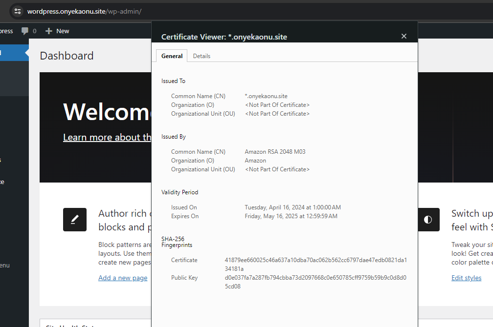

# Foundation Cohort Core 2 - AWS Solution Architect, Step 31, Wordpress Site on AWS

## Project Scenario

A small to medium-sized digital marketing agency **"DigitalBoost"** wants to enhance its online presence by creating a high-performance **wordpress-based** website for their clients. The agency needs a scalable, secure and cost-effective solution that can handle increasing traffic and seamlessly integrate with their existing infrastructure. Therefore, Cost, Security, and Scalability are the major requirements for this project.

Your task as an AWS Solution Architect is to design and implement a wordpress solution using various AWS services such as Networking, Compute, Object storage and Databases.

We will build a secure infrastructure inside AWS VPC (Virtual Private Cloud) network for the agency that uses **WordPress CMS** for its main business website. As part of the company’s desire for improved security and performance, a **reverse proxy technology from NGINX** will be deployed to achieve this.

## STARTING OFF OUR PROJECT

### Configuring DNS with Route53

1. Create a domain name for our DigitalBoost company (onyekaonu.site). You can use aws or other domain name registrars like [namecheap](www.namecheap.com) to register your domain name. 

3. Create a hosted zone in AWS Route53, and map it to your domain. Make sure to update the nameservers of your domain registrar with the nameservers form the aws hosted zone created.

3. Request for a certificate for the domain using AWS Certificate Manager (ACM). Request for a wild card certificate (*.onyekaonu.site). Choose DNS validation and while its pending click on **Create records in Route 53** for DNS validation. Make sure that your NS record is propagating, you can use the dns checker [here](https://dnschecker.org) and that ACM can successfully create a CNAME record in your hosted zone. And that the certificate is issued.

### SET UP A VIRTUAL PRIVATE NETWORK (VPC)

Always make reference to the architectural diagram and ensure that your configuration is aligned with it.

1. Create a VPC (onyi-vpc with IPV4 CIDR of 10.1.0.0/16)
  - Enable DNS hostnames

2. Create subnets as shown in the architecture
  - onyi-public-subnet-1 with IPV4 CIDR of 10.1.0.0/24 in eu-west-2a
  - onyi-public-subnet-2 with IPV4 CIDR of 10.1.1.0/24 in us-east-2b
  - onyi-private-subnet-1 with IPV4 CIDR of 10.1.2.0/24 in us-east-2a
  - onyi-private-subnet-2 with IPV4 CIDR of 10.1.3.0/24 in us-east-2b
  - onyi-private-subnet-3 with IPV4 CIDR of 10.1.4.0/24 in us-east-2a
  - onyi-private-subnet-4 with IPV4 CIDR of 10.1.5.0/24 in us-east-2b

3. Create a route table (public) and associate it with public subnets
  - Name: onyi-public-rtb

4. Create a route table (private) and associate it with private subnets
  - Name: onyi-private-rtb 

5. Create an Internet Gateway (onyi-igw) and attach to our VPC

6. Edit a route in public route table, and associate it with the Internet Gateway. (This is what allows a public subnet to be accesible from the Internet)

7. Create an Elastic IP (onyi-elip)

8. Create a Nat Gateway and assign the Elastic IP. Go back to your private route table and edit it to point to the nat gateway created (onyi-nat)

9. Create Security Groups for:

- **External Application Load Balancer**: External ALB will be available from the Internet(ext-alb-sg). Create a http and https rule and open it to 0.0.0.0/0.

- **Bastion Servers**: Access to the Bastion servers should be allowed only from workstations that need to SSH into the bastion servers. Hence, you can use your workstation public IP address. To get this information, simply go to your terminal and type curl www.canhazip.com (bastion-sg).

- **Nginx reverse proxy Servers**: Access to Nginx should only be allowed from an external Application Load balancer (ALB). So create a http and https rule and reference the security group for the external Application load balancer. Also since we may need to ssh from bastion into the nginx reverse proxy server , we also need to open ssh port in the inbound rule referencing the security group for the bastion (nginx-sg).

- **Internal Load balancer**: Internal Application load balancer will be available from the nginx reverse proxy servers. So create inbound rule http and https to reference the security group for the nginx reverse proxy servers (int-alb-sg).

- **Webservers**: Access to Webservers should only be allowed from the Internal load balancer. So edit the inbound rule http and https to reference the security group for the Internal Application load balancer. Also since we may need to ssh from bastion into the webservers , we also need to open ssh port in the inbound rule referencing the security group for the bastion (webservers-sg).

- **Data Layer**: Access to the Data layer, which is comprised of Amazon Relational Database Service (RDS) and Amazon Elastic File System (EFS) must be carefully designed – webservers should be able to connect to RDS through mysql port and also have access to EFS Mountpoint through NFS port using the security group for the webservers .Also since we may need to go from bastion into the RDS using mysql-client , we also need to open mysql port in the inbound rule referencing the security group for the bastion (datalayer-sg)

### SETUP RDS

**Pre-requisite**: Create a KMS key from Key Management Service (KMS) to be used to encrypt the database instance.

Amazon Relational Database Service (Amazon RDS) is a managed distributed relational database service by Amazon Web Services. This web service running in the cloud designed to simplify setup, operations, maintenance & scaling of relational databases. 

To ensure that your databases are highly available and also have failover support in case one availability zone fails, we will configure a multi-AZ set up of RDS MySQL database instance. In our case, since we are only using 2 AZs, we can only failover to one.

To configure RDS, follow steps below:

1. Create a subnet group and add 2 private subnets (data Layer)(10.1.4.0/24 and 10.1.5.0/24)

2. Create an RDS Instance for mysql 8.*.*

3. To satisfy our architectural diagram, you will need to select either Dev/Test or Production Sample Template. But to minimize AWS cost, you can select the free tier. The production template will enable Multi-AZ deployment.

4. Configure other settings accordingly (For test purposes, most of the default settings are good to go). In the real world, you will need to size the database appropriately. You will need to get some information about the usage. If it is a highly transactional database that grows at 10GB weekly, you must bear that in mind while configuring the initial storage allocation, storage autoscaling, and maximum storage threshold.

5. Choose your Master username (onyi_admin) and Master password (admin12345).

6. Configure VPC and security (ensure the database is not available from the Internet).

7. Create a database (wordpressdb) from the advance settings.

8. Select the encryption key.

9. Configure backups and retention.

10. Encrypt the database using the KMS key created earlier.

11. Enable CloudWatch monitoring and export Error and Slow Query logs (for production, also include Audit).

### SETUP EFS

Amazon Elastic File System (Amazon EFS) provides a simple, scalable, fully managed elastic Network File System (NFS) for use with AWS Cloud services and on-premises resources. In this project, we will utulize EFS service and mount filesystems on both Nginx and Webservers to store data.

1. Create an EFS filesystem. Click on `Customize` box to select your vpc and subnet which should be the same subnet of the webservers.

2. Create an EFS access point. This is what we specify the webserver to mount with. (Give it a name and leave all other settings as default)

### SETUP AMI

For you to create an autoscaling group you need an ami, a launch template and a target group, and the target group must have been attached to a load balancer.

So we will create a target group followed by the launch template followed by the load balancer then the autoscaling group. Ofcourse before you create the launch template you need to create the ami.

The port for the nginx and webservers must be set to port 443, so that there will be a secure connection between the external loadbalancer and the nginx server and also the internal loadbalancer with the wordpress webservers. Therefore our loadbalancers must be sending traffic to port 443 and our nginx and webservers must be listening on port 443. When creating the target group you must select port 443. For this connection to be secure, we need to have a self signed certificate on the nginx and webservers. Therefore the AMIs must have these certificates resident in them.

Provision three redhat instances for nginx, bastion and webservers. SSh into them and install the neccessary software and certificates. Use the guild from `installation.md` file.

When creating the certificate use the private dns name of the instance for the common name. 

Create an AMI out of the EC2 instance.

### SETUP COMPUTE RESOURCES

#### Set Up Compute Resources for Nginx

Provision EC2 Instances for Nginx

1. Create an EC2 Instance based on Redhat Amazon Machine Image (AMI).
2. Ensure that it has the following software installed (telnet htop git net-tools chrony). Refer to installation.md file for bastion ami installation.
4. Install the neccessary certificates using the guild from installation.md file.
3. Create an AMI out of the EC2 instance

##### Configure Target Groups
1. Select Instances as the target type
2. Ensure the protocol HTTPS on secure TLS port 443
3. Ensure that the health check path is /

##### Prepare Launch Template For Nginx (One Per Subnet)
1. Choose a name for the launch template and make use of the nginx AMI to set up a launch template.
2. Select Instance type and keypair.
3. Ensure the Instances are launched into a public subnet
4. Assign appropriate security group
5. Since nginx will be launched into the public subnet, you can enable Auto-assign public IP.
6. In the advanced details, use the `nginx-userdata.md` to configure the launch template. This will update yum package repository and install nginx.

##### Configure Autoscaling For Nginx
1. Select the right launch template
2. Select the VPC
3. Select both public subnets
4. Enable Application Load Balancer for the AutoScalingGroup (ASG)
5. Select the target group you created before
6. Ensure that you have health checks for both EC2 and ALB
7. The desired capacity is 1
8. Minimum capacity is 1
9. Maximum capacity is 1
10. Set scale out if CPU utilization reaches 90%
11. Ensure there is an SNS topic to send scaling notifications
12. Add tags to tag new instances

#### Set Up Compute Resources for Bastion

Provision the EC2 Instances for Bastion

1. Create an EC2 Instance based on Redhat Amazon Machine Image (AMI).
2. Ensure that it has the following software installed (telnet htop git net-tools chrony). Refer to installation.md file for bastion ami installation.
3. Create an AMI out of the EC2 instance.

##### Configure Target Groups
Since our bastion will not be placed under a load balancer, there wont be any need to configure a target group for it.

##### Prepare Launch Template For Bastion (One per subnet)
1. Choose a name for the launch template and make use of the bastion AMI to set up a launch template.
2. Select Instance type and keypair.
3. Ensure the Instances are launched into a public subnet.
4. Assign appropriate security group.
5. Since bastion will be launched into the public subnet, you can enable Auto-assign public IP.
6. In the advanced details, use the `bastion-userdata.md` to configure the launch template. This will update yum package repository and install packages.

##### Configure Autoscaling For Bastion
1. Select the right launch template
2. Select the VPC
3. Select both public subnets
4. The desired capacity is 1
5. Minimum capacity is 1
6. Maximum capacity is 1
7. Set scale out if CPU utilization reaches 90%
8. Ensure there is an SNS topic to send scaling notifications
9. Add tags to tag new instances

#### Set Up Compute Resources for Webservers

Provision the EC2 Instances for Webservers

1. Create an EC2 Instance Redhat Amazon Machine Image (AMI) each for WordPress website.
2. Ensure that it has the following software installed (telnet htop git net-tools chrony mariadb105 amazon-efs-utils). Refer to installation.md file for bastion ami installation.
4. Install the neccessary certificates using the guild from installation.md file.
3. Create an AMI out of the EC2 instance

##### Configure Target Groups
1. Select Instances as the target type
2. Ensure the protocol HTTPS on secure TLS port 443
3. Ensure that the health check path is /

##### Prepare Launch Template For Webservers (One per subnet)
1. Choose a name for the launch template and make use of the webserver AMI to set up a launch template.
2. Select Instance type and keypair.
3. Ensure the Instances are launched into a private subnet.
4. Assign appropriate security group.
5. In the advanced details, use the `wordpress-userdata.md` to configure the launch template.

##### Configure Autoscaling For webservers
1. Select the right launch template
2. Select the VPC
3. Select both private subnets
4. Enable Application Load Balancer for the AutoScalingGroup (ASG)
5. Select the target group you created before
6. Ensure that you have health checks for both EC2 and ALB
7. The desired capacity is 1
8. Minimum capacity is 1
9. Maximum capacity is 1
10. Set scale out if CPU utilization reaches 90%
11. Ensure there is an SNS topic to send scaling notifications
12. Add tags to tag new instances

##### SETUP COMPUTE RESOURCES SUMMARY

- Provision three redhat instances for nginx, bastion and webservers.

- Install the neccessary software and certificates using the guild from installation.md file. When creating the certificate use the private dns name of the instance for the common name. 

- Create an AMI out of the EC2 instance

- Configure Target Groups Nginx and webservers (wordpress) and not for bastion because bastion will not be behind the loadbalancer.

- Create the external and internal loadbalancers because you will need to update the reverse.conf file with the endpoint of the internal loadbalancer while creating launch template.

- Update the reverse.conf file with the endpoint of the internal loadbalancer, the wordpress-userdata with the mount point of the efs file system and the rds endpoint with its credentials. 

- Prepare Launch Template For Nginx, bastion, wordpress webservers. Use the userdata for the respective server.

- Create and configure Autoscaling For bastion, nginx and webservers

### CONFIGURE APPLICATION LOAD BALANCER (ALB)

#### External Application Load Balancer To Route Traffic To NGINX

Nginx EC2 Instances will have configurations that accepts incoming traffic only from Load Balancers. No request should go directly to Nginx servers. With this kind of setup, we will benefit from intelligent routing of requests from the ALB to Nginx servers across the 2 Availability Zones. We will also be able to offload SSL/TLS certificates on the ALB instead of Nginx. Therefore, Nginx will be able to perform faster since it will not require extra compute resources to valifate certificates for every request.

1. Create an Internet facing ALB

2. Ensure that it listens on HTTPS protocol (TCP port 443)

3. Ensure the ALB is created within the appropriate VPC | AZ | Subnets (onyi-public-subnet-1 with IPV4 CIDR of 10.0.0.0/24 in us-east-2a and  onyi-public-subnet-2 with IPV4 CIDR of 10.0.1.0/24 in us-east-2b).

4. Choose the Certificate from ACM

5. Select Security Group (ext-alb-sg)

6. Select Nginx Instances as the target group

#### Internal Application Load Balancer To Route Traffic To Web Servers

Since the webservers are configured for auto-scaling, there is going to be a problem if servers get dynamically scalled out or in. Nginx will not know about the new IP addresses, or the ones that get removed. Hence, Nginx will not know where to direct the traffic.

To solve this problem, we must use a load balancer. But this time, it will be an internal load balancer. Not Internet facing since the webservers are within a private subnet, and we do not want direct access to them.

1. Create an Internal ALB

2. Ensure that it listens on HTTPS protocol (TCP port 443)

3. Ensure the ALB is created within the appropriate VPC | AZ | Subnets. (onyi-private-subnet-1 with IPV4 CIDR of 10.0.2.0/24 in us-east-2a and onyi-private-subnet-2 with IPV4 CIDR of 10.0.3.0/24 in us-east-2b)

4. Choose the Certificate from ACM

5. Select Security Group (int-alb-sg)

6. Select webserver Instances as the target group

7. Ensure that health check passes for the target group

### Configuring DNS with Route53

1. Create other records such alias and A records. **NOTE**: You can use either CNAME or alias records to achieve the same thing. But alias record has better functionality because it is a faster to resolve DNS record, and can coexist with other records on that name. Create an alias record for the sub-domain (wordpress.onyekaonu.site) which is the wordpress site for **"DigitalBoost"** and direct its traffic to the ALB DNS name.

2. Check the wordpress site from the browser and ensure that the WordPress website can be reached HHTPS. If everything goes well, you have bellow images.

#### Challenges

If the nginx terget group is unhealthy, the external loadbalancer will not route traffic to the nginx server. To fix this, ssh into your nginx server and check the nginx reverse proxy configuration on /etc/nginx/nginx.conf. Run the sudo nginx -t for confirmation.

If the webserver terget group is unhealthy, the internal loadbalancer will not route traffic to the webserver. To fix this, make sure that the efs file system is created inside the same subnet with the webservers and that the access mount point has the necessary permissions. You can fix this by editing the userdata in the webserver launch template and updating the webserver's autoscaling group with the correct version of the launch template.
