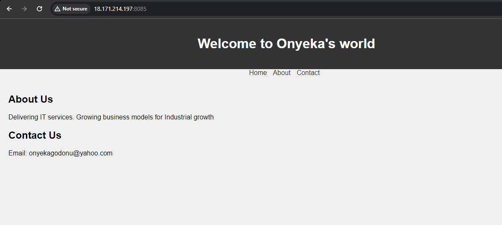
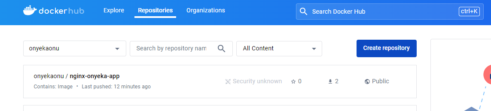
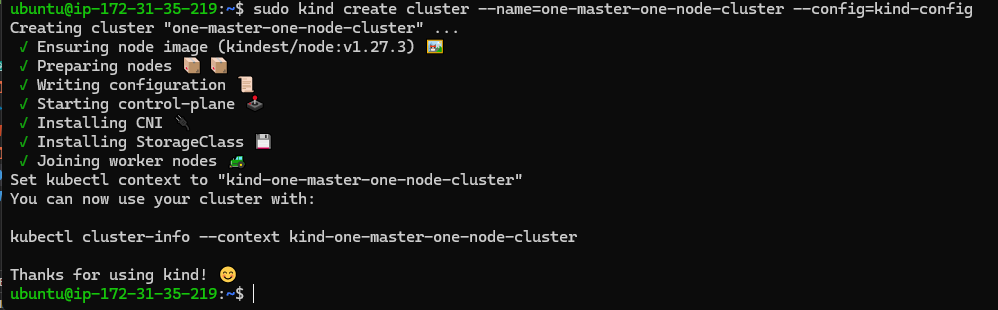
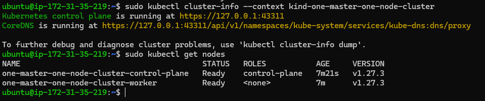

# CAPSTONE PROJECT - CONTAINERIZATION AND CONTAINER ORCHESTRATION

You are developing a simple static website for a company's landing page. The goal is to conterize the application using docker, deploy it to a kubernetes cluster and access it through nginx.

## TASK:

## STEP 1

Create a new project directory in your repository. Inside the directory, create (using ChatGPT) an HTML file (index.html) and a CSS file (style.css). Git add, commit and push to your remote repo.

## STEP 2

Dockerize the application: Create a Dockerfile specifying nginx as the base image. Copy the hmtl and css files into the nginx html directory.

```
# Use NGINX as the base image
FROM nginx

# Set working directory within the NGINX HTML directory
WORKDIR /usr/share/nginx/html

# Copy the HTML and CSS files into the container's HTML directory
COPY index.html .
COPY styles.css .

# Expose port 80 for NGINX
EXPOSE 80
```

FROM nginx: This line specifies that we are using the official NGINX Docker image as the base image for our container. This means that our container will include all the necessary files and configurations to run NGINX.

WORKDIR /usr/share/nginx/html: This command sets the working directory within the NGINX container to /usr/share/nginx/html. This directory is typically where NGINX serves static HTML files from.

COPY index.html .: This line copies the index.html file from the build context (the directory where the Dockerfile is located) into the /usr/share/nginx/html directory within the container. The . after index.html means "copy it to the current directory," which in this case is /usr/share/nginx/html.

COPY styles.css .: Similarly, this line copies the styles.css file from the build context into the /usr/share/nginx/html directory within the container.

EXPOSE 80: This command exposes port 80 on the container. Port 80 is the default port for HTTP traffic, so by exposing it, we allow external clients to access our NGINX server running inside the container.

Build the image

```
docker build -t nginx-onyeka-app:0.1 .
```

Run the image and check your application on the browser
```
docker run -itd --name nginx-onyeka-app -p 8085:80 nginx-onyeka-app:0.1
```



## STEP 3

Push to docker hub: login to docker hub, tag and push your docker image.

Log into your dockerhub account and create a repository i.e onyekaonu

Tag the image with name of the repository created in docker hub, log into your dockerhub using your username and password from the terminal and push the image to the dockerhub. Verify on dockerhub

```
docker tag nginx-onyeka-app:0.1 onyekaonu/nginx-onyeka-app:0.1
docker login
docker push onyekaonu/nginx-onyeka-app:0.1
```



## STEP 4

### Setup a kind kubernetes cluster: Install kind and create a kind cluster.

Create a K8s cluster with KinD on Ubuntu

Prerequisites

KinD can be installed on machines with minimal hardware configuration but for the purposes of running applications, the minimum specs required are:8 virtual CPUs (4 physical cores), 16GB of RAM.

This will allow you to allocate 4 vCPUs and 8GB of RAM to Docker.

### Install Docker Engine

In order to use KinD, we need to install Docker first.

```
# Install packages that allow APT to use HTTPS:
sudo apt-get update
sudo apt-get install -y \
    apt-transport-https \
    ca-certificates \
    curl \
    gnupg-agent \
    software-properties-common

# Add Docker’s GPG key:
curl -fsSL https://download.docker.com/linux/ubuntu/gpg | sudo apt-key add - 

# Add the Docker repository:
sudo add-apt-repository \
    "deb [arch=amd64] https://download.docker.com/linux/ubuntu \
    $(lsb_release -cs) \
    stable" 

# Install the Docker engine:
sudo apt-get update
sudo apt-get install -y docker-ce docker-ce-cli containerd.io 

# Add your login to the Docker group:
sudo usermod -aG docker $USER 
```

Logout of your SSH session and log back in for the changes to take effect.

Install kubectl

The Kubernetes command-line tool allows you to deploy and manage Kubernetes clusters. Without it, there’s not much you can do with a KinD cluster.
```
# Download kubectl:
sudo curl -L "https://storage.googleapis.com/kubernetes-release/release/`curl -s https://storage.googleapis.com/kubernetes-release/release/stable.txt`/bin/linux/amd64/kubectl" -o /usr/local/bin/kubectl 

# Make the app executable:
sudo chmod +x /usr/local/bin/kubectl 
```

### Install KinD

Now that we have Docker installed, it’s time to install the kind tool.
```
# Download KinD:
sudo curl -L "https://kind.sigs.k8s.io/dl/v0.20.0/kind-$(uname)-amd64" -o /usr/local/bin/kind
# Make the app executable:
sudo chmod +x /usr/local/bin/kind 
# Test the installation:
kind get clusters 
```

If kind was installed correctly, you should see the following output:

No kind clusters found. 

If you got to this point, CONGRATULATIONS!

### Create the KinD configuration file kind-config
```
kind: Cluster
apiVersion: kind.x-k8s.io/v1alpha4
nodes:
- role: control-plane
  kubeadmConfigPatches:
  - |
    kind: InitConfiguration
    nodeRegistration:
      kubeletExtraArgs:
        node-labels: "ingress-ready=true"
  extraPortMappings:
  - containerPort: 80
    hostPort: 80
    protocol: TCP
  - containerPort: 443
    hostPort: 443
    protocol: TCP
- role: worker
```

### Start your KinD cluster with:

kind create cluster --name=one-master-one-node-cluster --config=kind-config
Note that this step will take about 2 minutes to complete. The output would look like:
```
Creating cluster "one-master-one-node-cluster" ...
 ✓ Ensuring node image (kindest/node:v1.27.3) 🖼 
 ✓ Preparing nodes 📦 📦  
 ✓ Writing configuration 📜 
 ✓ Starting control-plane 🕹️ 
 ✓ Installing CNI 🔌 
 ✓ Installing StorageClass 💾 
 ✓ Joining worker nodes 🚜 
Set kubectl context to "kind-one-master-one-node-cluster"
You can now use your cluster with:

kubectl cluster-info --context kind-one-master-one-node-cluster
```



```
kubectl cluster-info --context kind-one-master-one-node-cluster
kubectl get nodes
```


### Install Helm
```
curl https://baltocdn.com/helm/signing.asc | gpg --dearmor | sudo tee /usr/share/keyrings/helm.gpg > /dev/null
sudo apt-get install apt-transport-https --yes
echo "deb [arch=$(dpkg --print-architecture) signed-by=/usr/share/keyrings/helm.gpg] https://baltocdn.com/helm/stable/debian/ all main" | sudo tee /etc/apt/sources.list.d/helm-stable-debian.list
sudo apt-get update
sudo apt-get install helm
```

### Install nginx ingress in kubernetes
```
kubectl apply -f https://raw.githubusercontent.com/kubernetes/ingress-nginx/main/deploy/static/provider/kind/deploy.yaml
```

5. Deploy to kubernetes.

Create Deployment - Write a Kubernetes Deployment configuration YAML file (deployment.yaml)

Create a file deployment.yaml and paste the code snippet below
```
apiVersion: apps/v1
kind: Deployment
metadata:
  name: nginx-onyeka-app
  labels:
    app: nginx-onyeka-app
spec:
  replicas: 1
  selector:
    matchLabels:
      app: nginx-onyeka-app
  template:
    metadata:
      labels:
        app: nginx-onyeka-app
    spec:
      containers:
      - name: nginx-onyeka-app
        image:  onyekaonu/nginx-onyeka-app:0.1
        ports:
        - containerPort: 80
```

Create Service - Write Kubernetes Service configuration YAML file. The service exposes your application to external traffic.

Create a file service.yaml and paste the code snippet below.
```
apiVersion: v1
kind: Service
metadata:
  name: nginx-onyeka-app
spec:
  selector:
    app: nginx-onyeka-app
  ports:
    - protocol: TCP
      port: 80 # This is the port the service is listening on or the port of the service
      targetPort: 80 # This is the port the container is listening on or the port of the pod
```

Apply the Deployment and Service yaml files using the following commands:
```
kubectl apply -f deployment.yaml

kubectl apply -f service.yaml
```

6. Access the application: Port forward to the service to access the application and open the browser and visit the specified port to view your simple frontend application.

Port Forwarding:

Once you have identified the pod, you can use the kubectl port-forward command to forward a local port to a port on the pod.

kubectl port-forward <pod-name> <local-port>:<pod-port>

Replace <pod-name> with the name of your pod, <local-port> with the port on your local machine you want to use to access the application, and <pod-port> with the port your application is listening on within the pod.

Or

kubectl port-forward svc/nginx-onyeka-app 8086:80

Access the website through your browser on port 8089

