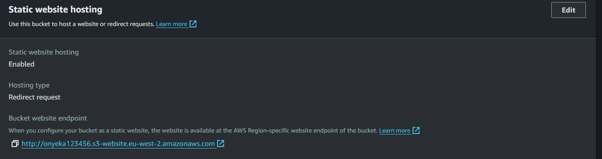

# Mini Project - Single Endpoint Architecture for Ec2 and S3 Services

## Creating S3 bucket

1. Create an s3 bucket with a unique name.


2. Upload an index.html file as an object

3. Configuring s3 bucket for web hosting: Enable static website hosting, this makes your content of your bucket accessible over HTTP.
- Click on your bucket name

- Click on your Properties tab and scrow down


- Edit Static website hosting and Configure as shown below and save




- Make your index.html file public. Navigate/select to the index.html file, click on `Actions`
and then click on ` Make public using ACL`


4. Testing from the s3 bucket. Copy the Object url and run on the browser


## Configure a webserver as a reverse proxy

1. Launch your ec2 machine. Assign an elastic IP to it.

2. Install nginx

```
sudo apt update -y && sudo apt install nginx -y
```

3. Configure your nginx/webserver to server your s3 application directly or to forward traffic to your s3 bucket
- Create and edit a new file named mybucket
```
sudo nano /etc/nginx/sites-available/mybucket
```

- Copy and paste the below snippet into the above file. (Remenber to change accordingly)

```
server {
    listen 80;
    server_name 18.133.243.248;  # Replace with your domain name or server IP address

    location / {
        proxy_pass https://onyeka123456.s3.eu-west-2.amazonaws.com/index.html; # Replace with the link you generated after you enabled  static web hosting for your bucket
        proxy_set_header Host onyeka123456.s3.eu-west-2.amazonaws.com;
        proxy_set_header X-Real-IP $remote_addr;
        proxy_set_header X-Forwarded-For $proxy_add_x_forwarded_for;
        proxy_set_header X-Forwarded-Proto $scheme;
    }
}
```

- Run the below commands
```
sudo unlink /etc/nginx/sites-enabled/default
sudo ln -s /etc/nginx/sites-available/mybucket /etc/nginx/sites-enabled/
sudo nginx -t
sudo systemctl reload nginx
```

4. Testing from the webserver


### Troubleshooting

```
sudo rm /etc/nginx/sites-enabled/default
sudo chown -R www-data:www-data /var/www/html
sudo tail -f /var/log/nginx/error.log
```
