# Capstone Project: Ecommerce Application CI/CD Pipeline
## Ecommerce with Git Action

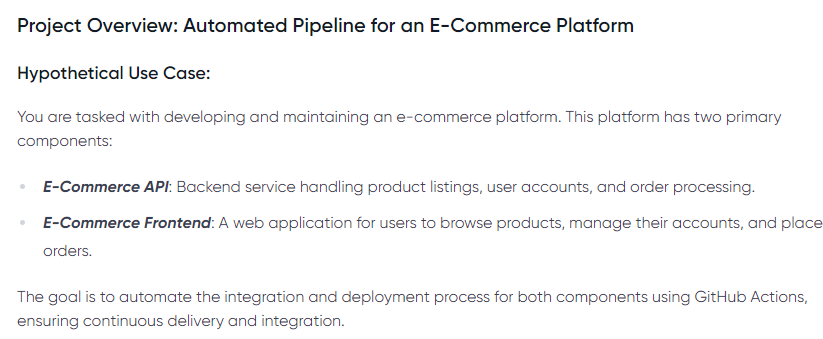

The github repo for this project is [here](https://github.com/onyeka-hub/ecommerce-with-git-action.git)

## Set Up

### Creating Backend Application

To run the Node.js/Express backend application and the React frontend application, you'll need to follow these steps:

Make sure you have Node.js installed on your system. You can download it from the official Node.js website.

- Go to github and create a repository called `ecommerce-with-git-action`
- Clone the repository on local machine and create two directories: api and app

Both directories are going to contain javascript code with api being the backend and app being the frontend.

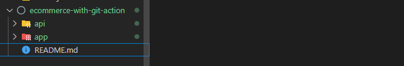

Install the required dependencies for the backend application

- Move into the api directory and initialize the directory with 
```sh
npm init -y
```

- Install express and cors dependencies with the below commands. Express is a backend framework built on nodejs used for building backend apis

```sh
npm install express
npm install cors
```

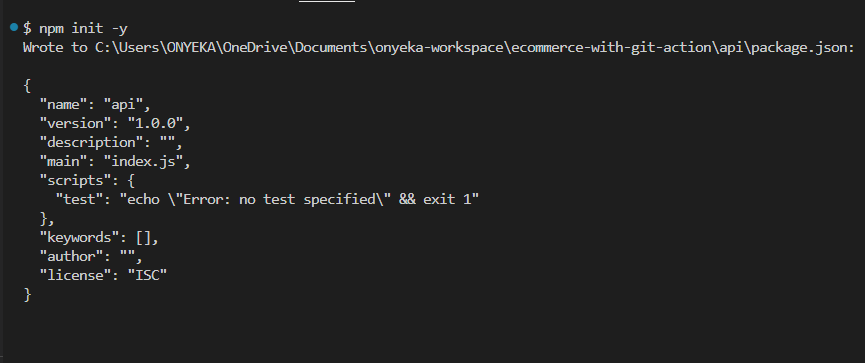

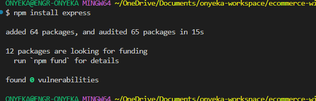

- In the api directory, create a file called server.js. This file contains the backend code for the ecommerce application

```js
const express = require('express');
const cors = require('cors');

const app = express();

// Enable CORS for all routes
app.use(cors());

const PORT = process.env.PORT || 4000;

// Middleware to parse JSON bodies
app.use(express.json());

// Dummy database (replace with a real database in a production environment)
let products = [];

// Root URL route
app.get('/', (req, res) => {
    res.send('Hello, World!');
});

// Routes
// Get all products
app.get('/products', (req, res) => {
    res.json(products);
});

// Get a single product by ID
app.get('/products/:id', (req, res) => {
    const productId = req.params.id;
    const product = products.find(prod => prod.id === productId);
    if (!product) {
        return res.status(404).json({ message: 'Product not found' });
    }
    res.json(product);
});

// Add a new product
app.post('/products', (req, res) => {
    const { name, price } = req.body;
    const newProduct = {
        id: String(products.length + 1),
        name,
        price
    };
    products.push(newProduct);
    res.status(201).json(newProduct);
});

// Update a product
app.put('/products/:id', (req, res) => {
    const productId = req.params.id;
    const { name, price } = req.body;
    const productIndex = products.findIndex(prod => prod.id === productId);
    if (productIndex === -1) {
        return res.status(404).json({ message: 'Product not found' });
    }
    products[productIndex] = {
        ...products[productIndex],
        name,
        price
    };
    res.json(products[productIndex]);
});

// Delete a product
app.delete('/products/:id', (req, res) => {
    const productId = req.params.id;
    products = products.filter(prod => prod.id !== productId);
    res.json({ message: 'Product deleted successfully' });
});

// Export the app for testing purposes
module.exports = app;

// Start the server if this file is run directly
if (require.main === module) {
    app.listen(PORT, () => {
        console.log(`Server is running on port ${PORT}`);
    });
}
```

- Now it is time to test the backend server. After the installation completes, start the backend server by running:

```sh
npm start
```
This command will start the server, and you should see a message indicating that the server is running on a specific port (e.g., Server is running on port 4000).

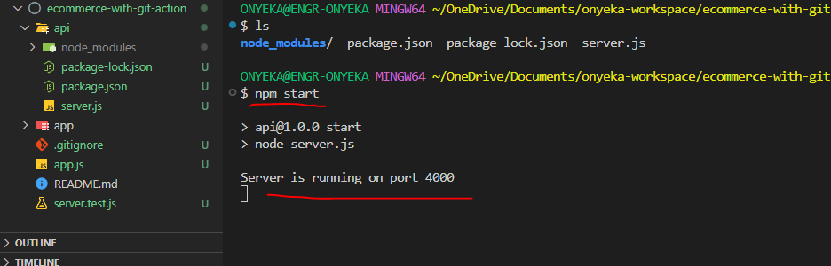

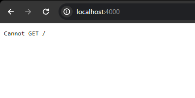

- Install POSTMAN extension on VSCODE and create an account to test the backend endpoint


- We will be testing one of the endpoints, the endpoint for adding a product and its price.

- On Postman create a collection > right click and create a new request > rename the request to "add_products" > add the localhost address "localhost:4000/products"

- Send in the name and price as a json body entry and click on send request
```
{
    "name": "laptop",
    "price": "1000"
}
```

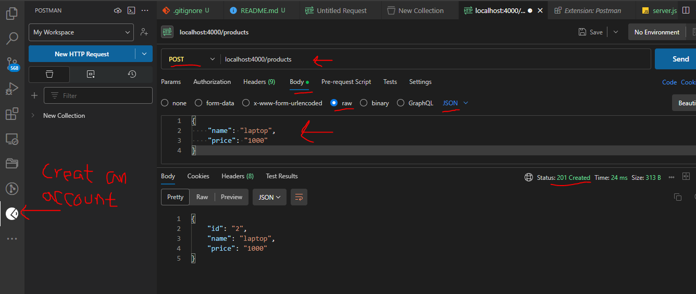

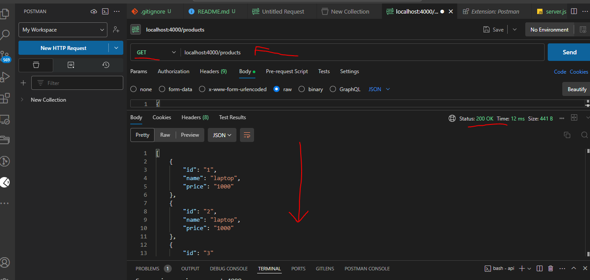

You can also download and install postman application on your local machine

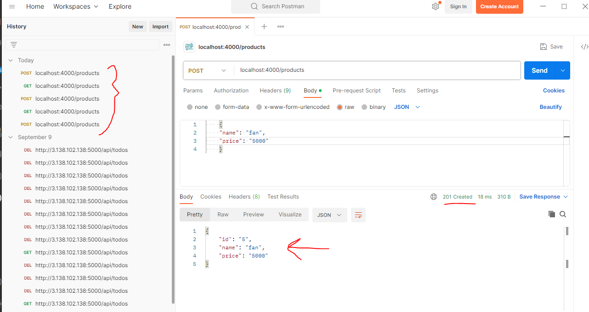

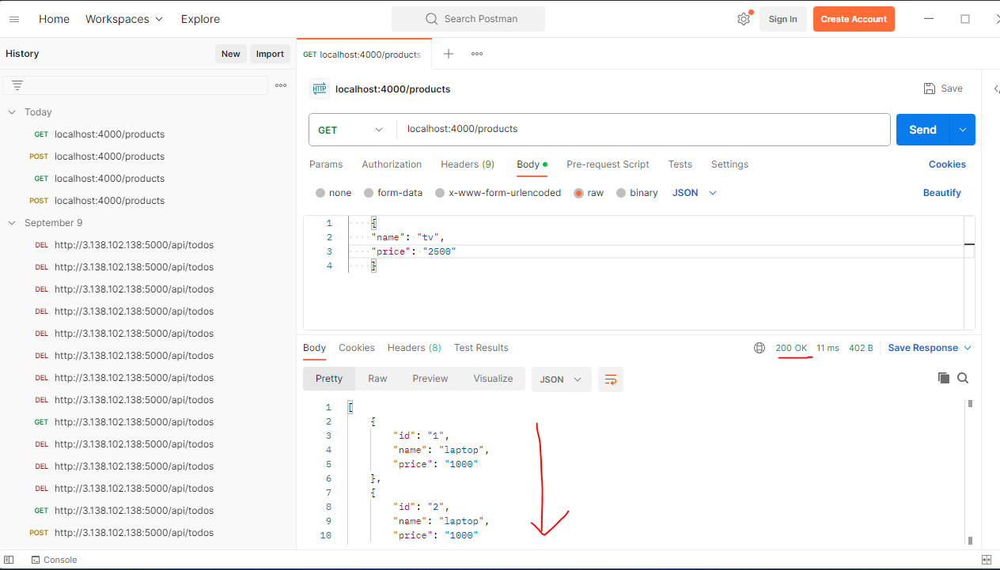

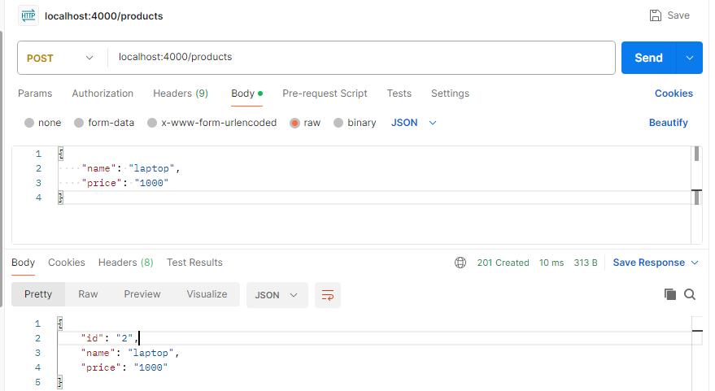

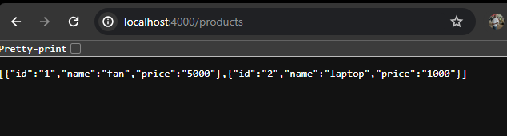

### Creating Test File for code

Create a test file called server.test.js inside api directory which tests the functionality of the backend code and ensures it behaves the way it should.
```js
const request = require('supertest');
const app = require('./server'); // Import the app directly

let server;

beforeAll(async () => {
    // Start the server before running tests
    server = app.listen(3000);
  
    // Wait for the server to be listening (optional)
    await new Promise(resolve => server.on('listening', resolve));
});
  
afterAll(async () => {
    // Close the server after all tests are done
    server.close();
});

describe('API Endpoints', () => {
    let productId;

    // Test for adding a new product
    it('should add a new product', async () => {
        const res = await request(app)
            .post('/products')
            .send({ name: 'Test Product', price: 10.99 });
        
        expect(res.statusCode).toEqual(201);
        expect(res.body).toHaveProperty('id');
        productId = res.body.id;
    });

    // Test for getting all products
    it('should get all products', async () => {
        const res = await request(app).get('/products');
        
        expect(res.statusCode).toEqual(200);
        expect(Array.isArray(res.body)).toBeTruthy();
    });

    // Test for getting a single product
    it('should get a single product', async () => {
        const res = await request(app).get(`/products/${productId}`);
        
        expect(res.statusCode).toEqual(200);
        expect(res.body).toHaveProperty('name', 'Test Product');
    });

    // Test for updating a product
    it('should update a product', async () => {
        const res = await request(app)
            .put(`/products/${productId}`)
            .send({ name: 'Updated Product', price: 15.99 });
        
        expect(res.statusCode).toEqual(200);
        expect(res.body).toHaveProperty('name', 'Updated Product');
    });

    // Test for deleting a product
    it('should delete a product', async () => {
        const res = await request(app).delete(`/products/${productId}`);
        
        expect(res.statusCode).toEqual(200);
        expect(res.body).toHaveProperty('message', 'Product deleted successfully');
    });
});
```

- Install jest and supertest which are tools for carrying out testing of javascript codebases
```sh
npm install --save-dev jest supertest
```

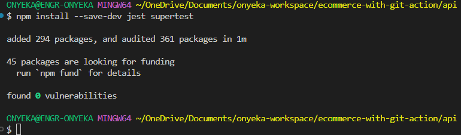

- To be able to run tests as npm test it is required to set up package.json file to execute the test. Edit the package.json file to point the test to the server.test.js and run the npm test command

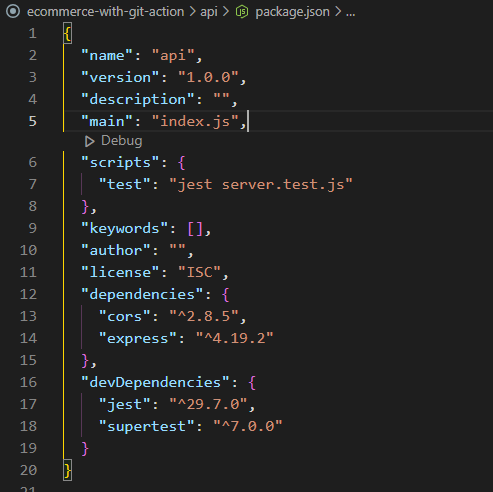

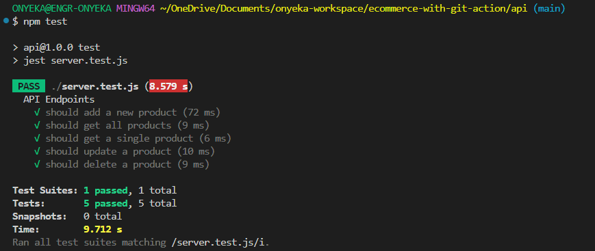

Create a new branch from your local machine, stage, commit and push to the remote repo. Test the git action workflow by creating a pull request. Merge after a successful git actions workflow.

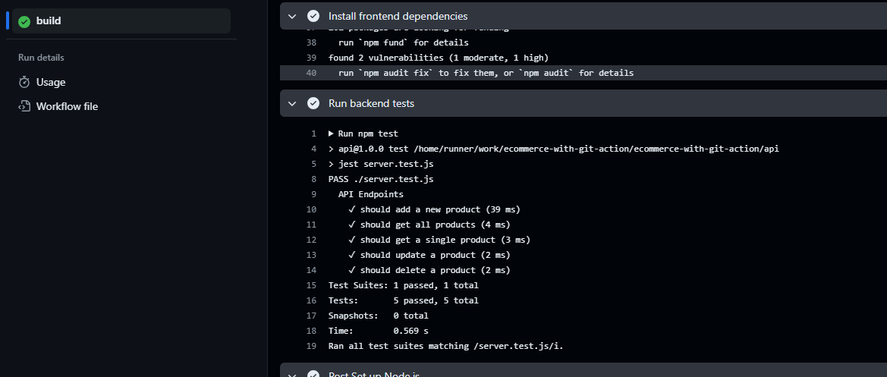


### Setting up frontend

- Move into the app directory. (You may want to create a new branch)

- Here we need to create a react app and this can be achieved using the below
```
npx create-react-app frontend
```

A frontend directory will be created inside the app directory that contains the starter code for a simple react application. This app will run on port 3000 on the browser in the frontend dir, use `npm start` to start it.

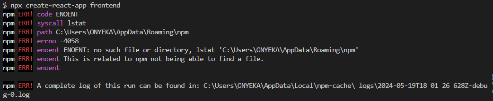

#### Solution

The error above (`ENOENT: no such file or directory, lstat 'C:\Users\ONYEKA\AppData\Roaming\npm'`) indicates that npm is looking for a directory that doesn't exist. This could be due to a missing or corrupted npm installation. Here’s how you can resolve this issue:

#### Steps to Fix the Error

1. Recreate the Missing Directory

The error message indicates that the `C:\Users\ONYEKA\AppData\Roaming\npm` directory is missing. You can manually create this directory.

- **Create the missing directory**:
   - Open File Explorer.
   - Navigate to `C:\Users\ONYEKA\AppData\Roaming`.
   - Create a new folder named `npm`.

Alternatively, you can create the directory using the command line:

```sh
mkdir C:/Users/ONYEKA/AppData/Roaming/npm
```

2. Clear npm Cache

Sometimes, clearing the npm cache can resolve issues.
```sh
npm cache clean --force
```

3. Reinstall npm Global Packages

If you have any global npm packages, reinstall them after creating the missing directory.

- **Reinstall global packages**:
```sh
npm install -g npm
```

4. Create a React App Again

Now try creating a React app again using `create-react-app`.
```sh
npx create-react-app frontend
```

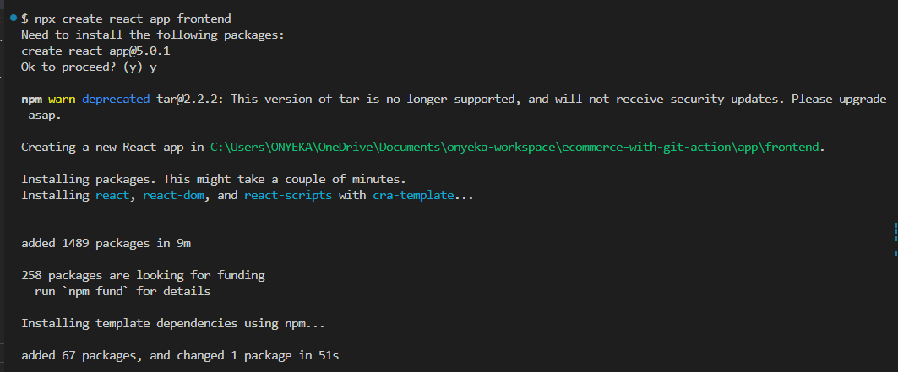

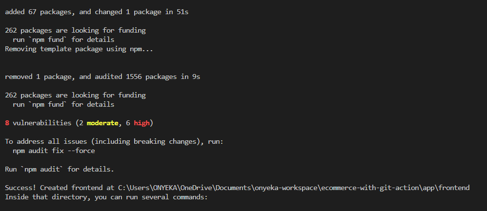

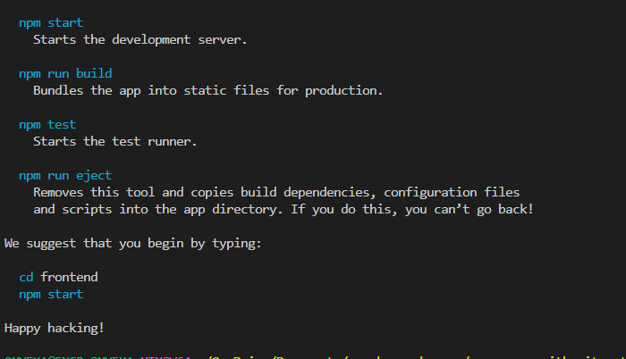

Cd into frontend directory and run the below command

```sh
npm start
```

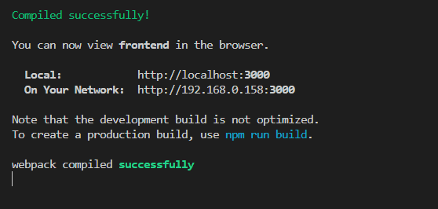

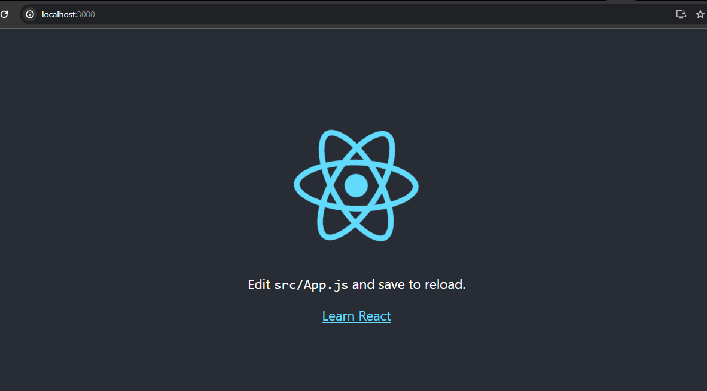

### Populating Frontend with Ecommerce Code
In the frontend directory,inside the src directory create two directories: components and styles

In the components dir, create two files named "ProductForm.jsx and ProductList.jsx"

In the styles dir create two files "ProductFormStyles.css and ProductListStyles.css"
    
ProductForm
```jsx
// ProductForm.jsx
import React, { useState } from 'react';
import '../styles/ProductFormStyles.css';

function ProductForm() {
  const [name, setName] = useState('');
  const [price, setPrice] = useState('');

  const handleSubmit = (e) => {
    e.preventDefault();
    // Add product logic
    console.log('Product added:', { name, price });
    setName('');
    setPrice('');
  };

  return (
    <form onSubmit={handleSubmit} className="product-form">
      <div>
        <label htmlFor="productName">Product Name:</label>
        <input
          id="productName"
          type="text"
          value={name}
          onChange={(e) => setName(e.target.value)}
        />
      </div>
      <div>
        <label htmlFor="productPrice">Product Price:</label>
        <input
          id="productPrice"
          type="number"
          value={price}
          onChange={(e) => setPrice(e.target.value)}
        />
      </div>
      <button type="submit">Add Product</button>
    </form>
  );
}

export default ProductForm;
```

ProductList
```jsx
// ProductList.jsx
import React from 'react';
import '../styles/ProductListStyles.css';

const products = [
  { id: 1, name: 'Product 1', price: 10.99 },
  { id: 2, name: 'Product 2', price: 15.99 }
];

function ProductList() {
  return (
    <div className="product-list">
      <h2>Product List</h2>
      <ul>
        {products.map((product) => (
          <li key={product.id}>
            {product.name} - ${product.price}
          </li>
        ))}
      </ul>
    </div>
  );
}

export default ProductList;
```
 
ProductFormStyles
```css
// ProductFormStyles.css
.product-form {
    margin: 20px;
  }
  
  .product-form div {
    margin-bottom: 10px;
  }
  
  .product-form label {
    margin-right: 10px;
  }
  
  .product-form input {
    padding: 5px;
  }
  
  .product-form button {
    padding: 5px 10px;
  }
```
   
ProductListStyles
```css
// ListingComponentStyles.css
.product-list {
    margin: 20px;
  }
  
  .product-list h2 {
    margin-bottom: 10px;
  }
  
  .product-list ul {
    list-style-type: none;
    padding: 0;
  }
  
  .product-list li {
    padding: 5px 0;
  }
  
```

Update the src/App.js with the snippet below
```js
import React from 'react';
import ProductForm from './components/ProductForm';
import ProductList from './components/ProductList';
import './styles/ProductFormStyles.css';
import './styles/ProductListStyles.css';

function App() {
  return (
    <div className="App">
      <header className="App-header">
        <h1>Product Management</h1>
      </header>
      <main>
        <ProductForm />
        <ProductList />
      </main>
    </div>
  );
}

export default App;
```

Cd into frontend directory and run the below command

```sh
npm start
```

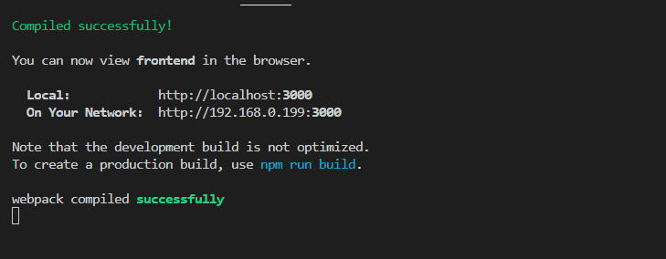

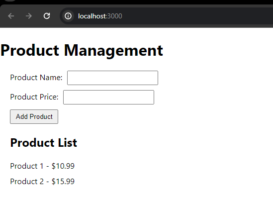

### Creating Test File for the frontend code

Update the test file called App.test.js inside src directory which tests snippet below
```js
import React from 'react';
import { render, screen } from '@testing-library/react';
import App from './App';

test('renders product management header', () => {
  render(<App />);
  const headerElement = screen.getByText(/Product Management/i);
  expect(headerElement).toBeInTheDocument();
});

test('renders product form', () => {
  render(<App />);
  const nameLabel = screen.getByLabelText(/Product Name/i);
  const priceLabel = screen.getByLabelText(/Product Price/i);
  expect(nameLabel).toBeInTheDocument();
  expect(priceLabel).toBeInTheDocument();
});

test('renders product list', () => {
  render(<App />);
  const listHeader = screen.getByText(/Product List/i);
  expect(listHeader).toBeInTheDocument();
});
```

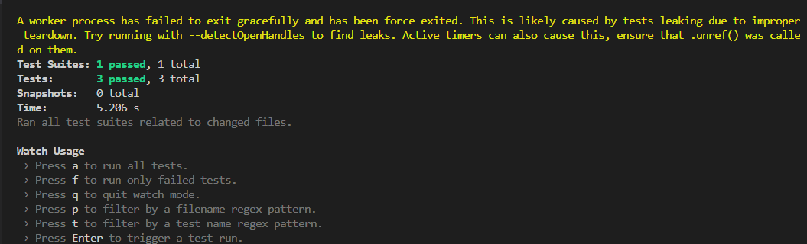

### Continuous Integration Workflow
We will be creating a github actions that performs basic CI/CD processes. The github action will

- Install dependencies
- Run tests
- Build application

This will be done for both frontend and backend

- Update the .github/workflows/build.yml file with the below configuration. You may want to create a new branch from your local machine, stage, commit and push to the remote repo. Test the git action workflow by creating a pull request. Merge after a successful git actions workflow.
```yaml
name: Full Stack CI
run-name: ${{ github.actor }} Full Stack CI

on:
  push:
    branches:
      - main
  pull_request:
    branches:
      - main

jobs:
  build:
    runs-on: ubuntu-latest

    steps:
      - name: Checkout code
        uses: actions/checkout@v2

      - name: Set up Node.js
        uses: actions/setup-node@v2
        with:
          node-version: '14'

      # Build the backend
      - name: Install backend dependencies
        run: npm install
        working-directory: api

      # Build the frontend
      - name: Install frontend dependencies
        run: npm install
        working-directory: app/frontend

    #   Run backend test
      - name: Run backend tests
        run: npm test
        working-directory: api

    #   Run frontend test
      - name: Run frontend tests
        run: npm test
        working-directory: app/frontend
```


Frontend test error

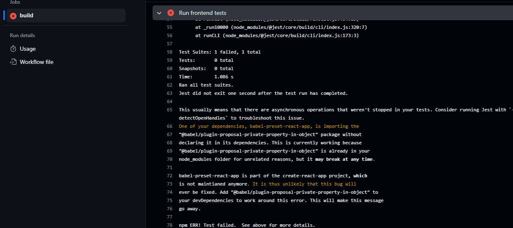

Solution
```sh
npm install --save-dev @babel/plugin-proposal-private-property-in-object

# To test for the error, run the below command
npx jest --detectOpenHandles
```

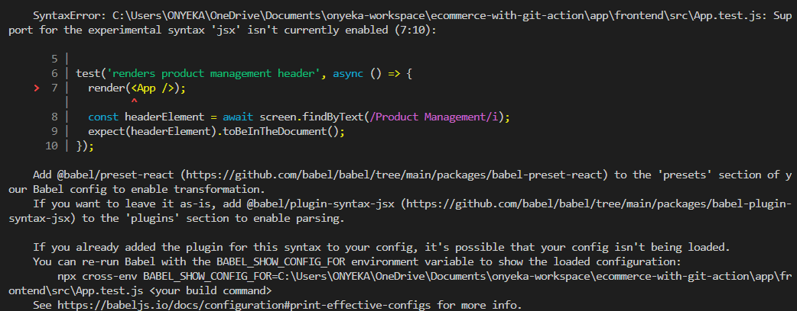

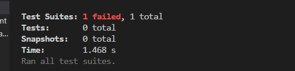

- Install @testing-library/react. This library is essential for testing React components as it provides utilities to test your React components without relying on their implementation details. 

```sh
npm install @testing-library/react @testing-library/jest-dom --save-dev
```
- Build the frontend code

Run `npm run build` from the terminal to build the react frontend application

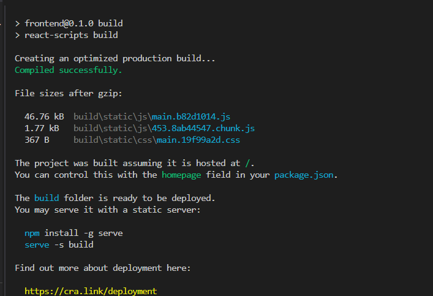

Update/add the .github/workflows/build.yml file with the below configuration. You may want to create a new branch from your local machine, stage, commit and push to the remote repo. Test the git action workflow by creating a pull request. Merge after a successful git actions workflow.
```yaml
name: Full Stack CI
run-name: ${{ github.actor }} Full Stack CI

on:
  push:
    branches:
      - main
  pull_request:
    branches:
      - main

jobs:
  build:
    runs-on: ubuntu-latest

    steps:
      - name: Checkout code
        uses: actions/checkout@v2

      - name: Set up Node.js
        uses: actions/setup-node@v2
        with:
          node-version: '14'

      # Install backend dependencies
      - name: Install backend dependencies
        run: npm install
        working-directory: api

      # Install frontend dependencies
      - name: Install frontend dependencies
        run: npm install
        working-directory: app/frontend

    #   Run backend test
      - name: Run backend tests
        run: npm test
        working-directory: api

      # Build the frontend
      - name: Build frontend
        run: npm run build
        working-directory: app/frontend
```

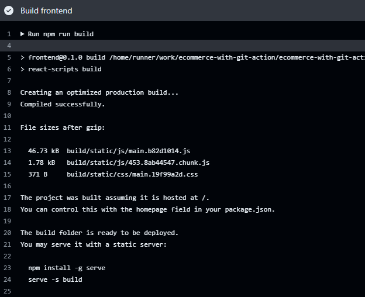

### Docker Integration
We will be creating dockerfiles for both frontend and backend. This docker file bundles the application into images which can be served from a container. Create a new branch - feature/docker from your local machine, stage, commit and push to the remote repo. Test the git action workflow by creating a pull request. Merge after a successful git actions workflow.


### For the backend application
create a file named Dockerfile in the root of your project (api directory) and add the below content to it.

```dockerfile
# Use the official Node.js image as the base image
FROM node:14

# Set the working directory inside the container
WORKDIR /app

# Copy the package.json and package-lock.json files to the working directory
COPY package*.json ./

# Install the dependencies
RUN npm install

# Copy the rest of the application code to the working directory
COPY . .

# Expose the port the app runs on
EXPOSE 4000

# Define the command to run the application
CMD ["npm", "start"]  # Or CMD ["node", "server.js"]
```

- **Build the Docker Image**: Open your terminal, navigate to your project directory, and run the following command to build the Docker image:
```sh
docker build -t ecommerce-backend .
```
This will build a Docker image named `ecommerce-backend`.

- **Run the Docker Container**: Once the image is built, you can run it using the following command:
```sh
docker run --name ecommerce-backend -p 4000:4000 ecommerce-backend
```
This will run the container and map port 4000 on your local machine to port 4000 on the container.

- **Access Your Application**: Open your web browser and navigate to `http://localhost:4000`. You should see your Express app running.

#### Additional Considerations

- **Environment Variables**: If your application requires environment variables, you can add them using the `-e` flag with the `docker run` command, or by creating an `.env` file and using Docker's support for environment files.
- **Docker Ignore File**: It's a good practice to create a `.dockerignore` file to exclude files and directories that are not needed in the Docker image (similar to `.gitignore`). For example:
```plaintext
node_modules
npm-debug.log
Dockerfile
.dockerignore
```

### For the frontend application
Create a file named Dockerfile in the root of your project (app/frontend directory) and add the below content to it.

```dockerfile
# Use an official Node.js runtime as a parent image
FROM node:14 as build

# Set the working directory
WORKDIR /app

# Copy package.json and package-lock.json
COPY package*.json ./

# Install dependencies
RUN npm install

# Copy the rest of the application code
COPY . .

# Build the React application
RUN npm run build

# Expose port 3000 to the outside world
EXPOSE 3000

# Command to run the application
CMD ["npm", "start"]
```

OR
```dockerfile
# Use an official Node.js runtime as a parent image
FROM node:14 as build

# Set the working directory
WORKDIR /app

# Copy package.json and package-lock.json
COPY package*.json ./

# Install dependencies
RUN npm install

# Copy the rest of the application code
COPY . .

# Build the React application
RUN npm run build

# Use nginx for serving static files
FROM nginx:alpine

# Copy the build output to the nginx html directory
COPY --from=build /app/build /usr/share/nginx/html

# Expose port 80
EXPOSE 80

# Start nginx
CMD ["nginx", "-g", "daemon off;"]
```

- **Build the Docker Image**: Open your terminal, navigate to your project directory, and run the following command to build the Docker image:
```sh
docker build -t ecommerce-frontend .
```
This will build a Docker image named `ecommerce-frontend`.

- **Run the Docker Container**: Once the image is built, you can run it using the following command:
```sh
docker run --name ecommerce-frontend -p 3000:3000 ecommerce-frontend
```
This will run the container and map port 3000 on your local machine to port 3000 on the container.

- **Access Your Application**: Open your web browser and navigate to `http://localhost:3000`. You should see your React app running.

#### Additional Considerations

- **Environment Variables**: If your React application requires environment variables during the build process, you can pass them using the `--build-arg` flag with the `docker build` command, and by defining `ARG` in your Dockerfile. For example:
```dockerfile
ARG REACT_APP_API_URL
ENV REACT_APP_API_URL $REACT_APP_API_URL
```

Then build the image with:
```sh
docker build --build-arg REACT_APP_API_URL=https://api.example.com -t ecommerce-frontend .
```

- **Docker Ignore File**: Create a `.dockerignore` file to exclude unnecessary files and directories from the Docker image (similar to `.gitignore`). For example:

```plaintext
node_modules
npm-debug.log
build
Dockerfile
.dockerignore
```

### Modify the github action workflows to build docker images

Below is an example of a GitHub Actions workflow file that will build and containerize both the Express and React applications. This workflow will build the Docker images and push them to Docker Hub.

#### GitHub Actions Workflow: `.github/workflows/docker-build.yml`

```yaml
name: Build and Push Docker Images
run-name: ${{ github.actor }} Build and Push Docker Images

on:
    push:
      branches:
        - 'main'
        - 'feature/*'
    pull_request:
      branches:
        - 'main'
        - 'feature/*'

jobs:
  build-and-push:
    runs-on: ubuntu-latest

    steps:
      - name: Checkout code
        uses: actions/checkout@v2

      - name: Set up Node.js
        uses: actions/setup-node@v2
        with:
          node-version: '14'

      # Install backend dependencies
      - name: Install backend dependencies
        run: npm install
        working-directory: api

      # Install frontend dependencies
      - name: Install frontend dependencies
        run: npm install
        working-directory: app/frontend

    #   Run backend test
      - name: Run backend tests
        run: npm test
        working-directory: api

      - name: Set up Docker Buildx
        uses: docker/setup-buildx-action@v2

      - name: Log in to Docker Hub
        uses: docker/login-action@v2
        with:
          username: ${{ secrets.DOCKER_USERNAME }}
          password: ${{ secrets.DOCKER_PASSWORD }}

      - name: Build and push Express app - ecommerce-backend
        uses: docker/build-push-action@v4
        with:
          context: ./api
          push: true
          tags: ${{ secrets.DOCKER_USERNAME }}/ecommerce-backend:latest

      - name: Build and push React app - ecommerce-frontend
        uses: docker/build-push-action@v4
        with:
          context: ./app/frontend
          push: true
          tags: ${{ secrets.DOCKER_USERNAME }}/ecommerce-frontend:latest
```

OR
```yaml
name: Full Stack CI

on:
  push:
    branches:
      - main
  pull_request:
    branches:
      - main

jobs:
  build:
    runs-on: ubuntu-latest

    steps:
      - name: Checkout code
        uses: actions/checkout@v2

      - name: Set up Node.js
        uses: actions/setup-node@v2
        with:
          node-version: '14'

      - name: Set up Node.js
        uses: actions/setup-node@v2
        with:
          node-version: '14'

      # Build the backend
      - name: Install backend dependencies
        run: npm install
        working-directory: api

      # Build the frontend
      - name: Install frontend dependencies
        run: npm install
        working-directory: app/frontend

    #   Run backend test
      - name: Run backend tests
        run: npm test
        working-directory: api

    #   Run backend test
      - name: Run frontend tests
        run: npm test
        working-directory: app/frontend

      # Build the backend Docker image
      - name: Build Backend Docker image
        run: docker build -t onyekaonu/ecommerce-backend:latest .
        working-directory: api

      # Build the frontend Docker image
      - name: Build Frontend Docker image
        run: docker build -t onyekaonu/ecommerce-frontend:latest .
        working-directory: app/frontend

      # Push the Docker image to a registry (replace with your registry)
      - name: Push Docker image
        run: |
          echo "$DOCKER_PASSWORD" | docker login -u "$DOCKER_USERNAME" --password-stdin
          docker push onyekaonu/ecommerce-backend:latest
          docker push onyekaonu/ecommerce-frontend:latest
        env:
            DOCKER_USERNAME: ${{ secrets.DOCKER_USERNAME }}
            DOCKER_PASSWORD: ${{ secrets.DOCKER_PASSWORD }}
```

OR
```yaml
name: Build and Push Docker Images
run-name: ${{ github.actor }} Build and Push Docker Images

on:
    push:
      branches:
        - 'main'
        - 'feature/*'
    pull_request:
      branches:
        - 'main'
        - 'feature/*'

jobs:
  build-and-push-backend:
    runs-on: ubuntu-latest

    steps:
      - name: Checkout code
        uses: actions/checkout@v2

      - name: Set up Node.js
        uses: actions/setup-node@v2
        with:
          node-version: '14'

      # Install backend dependencies
      - name: Install backend dependencies
        run: npm install
        working-directory: api

    #   Run backend test
      - name: Run backend tests
        run: npm test
        working-directory: api

      - name: Set up Docker Buildx
        uses: docker/setup-buildx-action@v2

      - name: Log in to Docker Hub
        uses: docker/login-action@v2
        with:
          username: ${{ secrets.DOCKER_USERNAME }}
          password: ${{ secrets.DOCKER_PASSWORD }}

      - name: Build and push Express app - ecommerce-backend
        uses: docker/build-push-action@v4
        with:
          context: ./api
          push: true
          tags: ${{ secrets.DOCKER_USERNAME }}/ecommerce-backend:latest

  build-and-push-frontend:
    needs: build-and-push-backend
    runs-on: ubuntu-latest

    steps:
      - name: Checkout code
        uses: actions/checkout@v2

      - name: Set up Node.js
        uses: actions/setup-node@v2
        with:
          node-version: '14'

      # Install frontend dependencies
      - name: Install frontend dependencies
        run: npm install
        working-directory: app/frontend

      - name: Set up Docker Buildx
        uses: docker/setup-buildx-action@v2

      - name: Log in to Docker Hub
        uses: docker/login-action@v2
        with:
          username: ${{ secrets.DOCKER_USERNAME }}
          password: ${{ secrets.DOCKER_PASSWORD }}

      - name: Build and push React app - ecommerce-frontend
        uses: docker/build-push-action@v4
        with:
          context: ./app/frontend
          push: true
          tags: ${{ secrets.DOCKER_USERNAME }}/ecommerce-frontend:latest
```
You can as well delete the .github/workflows/build.yml

#### Explanation

1. **Triggers**: The workflow is triggered on any push or pull request to the `main` and `feature/` branchs.

2. **Jobs**:
   - **Checkout code**: Uses `actions/checkout` to clone the repository.
   - **Set up Docker Buildx**: Uses `docker/setup-buildx-action` to set up Docker Buildx.
   - **Log in to Docker Hub**: Uses `docker/login-action` to log in to Docker Hub. Make sure to add your Docker Hub username and password as secrets in your GitHub repository (i.e., `DOCKER_USERNAME` and `DOCKER_PASSWORD`).
   - **Build and push Express app**: Uses `docker/build-push-action` to build and push the Docker image for your Express app. Assumes that your Express app is in a directory named `api`.
   - **Build and push React app**: Uses `docker/build-push-action` to build and push the Docker image for your React app. Assumes that your React app is in a directory named `app/frontend`.

### Additional Steps

1. **Add Docker Hub Credentials to GitHub Secrets**:
   - Go to your GitHub repository.
   - Click on `Settings`.
   - Click on `Secrets and variables` -> `Actions`.
   - Click `New repository secret`.
   - Add `DOCKER_USERNAME` with your Docker Hub username.
   - Add `DOCKER_PASSWORD` with your Docker Hub password.

2. **Commit and Push**:
   - Make sure your directory structure looks like this:
     ```
     .
     ├── .github
     │   └── workflows
     │       └── docker-build.yml
     ├── api
     │   └── Dockerfile
     ├── app
          └──frontend
     │       └── Dockerfile
     └── ... (other files)
     ```
   - Commit your changes and push to the `main` branch:
     ```sh
     git add .
     git commit -m "Add Docker build workflow"
     git push origin main
     ```

This setup will build and push your Docker images to Docker Hub whenever there is a push or pull request to the `main` and `feature/docker` branch. Make sure to replace `api` and `app/frontend` with the actual paths to your Express and React applications if they differ.

### Seperating Workflows into frontend and backend
During the course of deployment, backend and frontend could be worked on differently and because we are using of a single workflow backend could be rebuilt and pushed into the container repository dockerhub even if its code itself does not change.

To fix this, we need to seperate the workflows into frontend and backend workflows. In the workflows directory, create frontend-ci.yml and backend-ci.yml

```yaml
# frontend-ci.yml
name: Build and Push frontend Image only when there is a code changes
run-name: ${{ github.actor }} Build and Push frontend Image to dockerhub

on:
    push:
      paths: 
        - 'app/frontend/**' # Trigger only when changes are made in the app/frontend directory
    pull_request:
      paths: 
        - 'api/frontend/**'

jobs:
  build-and-push-frontend:
    runs-on: ubuntu-latest

    steps:
      - name: Checkout code
        uses: actions/checkout@v2

      - name: Set up Node.js
        uses: actions/setup-node@v2
        with:
          node-version: '14'

      # Install frontend dependencies
      - name: Install frontend dependencies
        run: npm install
        working-directory: app/frontend

      - name: Set up Docker Buildx
        uses: docker/setup-buildx-action@v2

      - name: Log in to Docker Hub
        uses: docker/login-action@v2
        with:
          username: ${{ secrets.DOCKER_USERNAME }}
          password: ${{ secrets.DOCKER_PASSWORD }}

      - name: Build and push React app - ecommerce-frontend
        uses: docker/build-push-action@v4
        with:
          context: ./app/frontend
          push: true
          tags: ${{ secrets.DOCKER_USERNAME }}/ecommerce-frontend:latest
```

```yaml
# backend-ci.yml
name: Build and Push backend Image only when there is a code changes
run-name: ${{ github.actor }} Build and Push backend Image to dockerhub

on:
    push:
      paths: 
        - 'api/**' # Trigger only when changes are made in the api directory
    pull_request:
      paths: 
        - 'api/**'

jobs:
  build-and-push-backend:
    runs-on: ubuntu-latest

    steps:
      - name: Checkout code
        uses: actions/checkout@v2

      - name: Set up Node.js
        uses: actions/setup-node@v2
        with:
          node-version: '14'

      # Install backend dependencies
      - name: Install backend dependencies
        run: npm install
        working-directory: api

    #   Run backend test
      - name: Run backend tests
        run: npm test
        working-directory: api

      - name: Set up Docker Buildx
        uses: docker/setup-buildx-action@v2

      - name: Log in to Docker Hub
        uses: docker/login-action@v2
        with:
          username: ${{ secrets.DOCKER_USERNAME }}
          password: ${{ secrets.DOCKER_PASSWORD }}

      - name: Build and push Express app - ecommerce-backend
        uses: docker/build-push-action@v4
        with:
          context: ./api
          push: true
          tags: ${{ secrets.DOCKER_USERNAME }}/ecommerce-backend:latest
```

### Deploy to the Cloud

- Choose a cloud platform for deployment like AWS

- Configure github action to deploy the docker image to the AWS ECR

- Configure github action to deploy the docker image to the AWS ECS

- Use github secrets to securely store and access cloud credentials

#### Continous Deployment

- Configure your workflow to deploy updates automatically to the cloud environment when changes are pushed to the main branch.

- Ensure all sensitive data, including API keys and database credentials are secured using github secrets.

To deploy your Docker images to AWS using GitHub Actions, you can use the AWS CLI and the `amazon-ecr-login` GitHub Action for authenticating and pushing images to Amazon Elastic Container Registry (ECR). Additionally, you can use AWS Elastic Beanstalk, ECS (Elastic Container Service), or another AWS service for deployment.

Below is an example GitHub Actions workflow that builds Docker images for your Express and React apps, pushes them to Amazon ECR, and then deploys them using AWS Elastic Container Service.

#### Pre-requisites

1. **AWS Account**: Ensure you have an AWS account.
2. **AWS ECR Repository**: Create ECR repositories for your applications.
3. **AWS IAM User**: Create an IAM user with permissions to push to ECR and deploy to Elastic Container Service. Store the AWS Access Key and Secret Access Key as GitHub secrets.

- Create AWS ECR private Repositories with names - capstone-ecommerce-backend and capstone-ecommerce-frontend

#### Create AWS IAM User, Policy, and Group

- Create IAM Policy - AllowPushPullPolicy
```json
{
    "Version": "2012-10-17",
    "Statement": [
        {
            "Sid": "ECR",
            "Effect": "Allow",
            "Action": [
                "ecr:GetAuthorizationToken",
                "ecr:BatchCheckLayerAvailability",
                "ecr:InitiateLayerUpload",
                "ecr:UploadLayerPart",
                "ecr:CompleteLayerUpload",
                "ecr:PutImage"
            ],
            "Resource": "*"
        },
        {
            "Sid": "SecretsManager",
            "Effect": "Allow",
            "Action": [
                "secretsmanager:GetSecretValue"
            ],
            "Resource": "arn:aws:secretsmanager:*:*:secret:ecr-pullthroughcache/*",
            "Condition": {
                "StringEquals": {
                    "aws:ResourceAccount": "${aws:PrincipalAccount}"
                }
            }
        }
    ]
}
```

You can limit the permission to only the repositories by specifying only the repos in the resourse section above
```json
 "Resource": [
        "arn:aws:ecr:eu-west-2:072824470958:repository/capstone-ecommerce-*"
      ]
```
- Create IAM Group - push-pull-images and attach AllowPushPullPolicy IAM Policy

- Create IAM user - github-actions and place it to push-pull-images IAM Group

- Get the aws-access-key-id and aws-secret-access-key for the user, go to github and create github secrets AWS_ACCESS_KEY_ID and AWS_SECRET_ACCESS_KEY (you can get the names from github workflow yaml file)

#### Update the workflow yaml files
-Create a new branch - feature/aws-deploy from your local machine, stage, commit and push to the remote repo. Test the git action workflow by creating a pull request. Merge after a successful git actions workflow.

- Update the workflow yaml files .github/workflows/frontend.yml and .github/workflows/backend.yml with the snippet below

```yaml
# backend-ci.yml
name: Build, Push and Deploy backend Image to AWS
run-name: ${{ github.actor }} Build and Push backend Image to AWS ECR

on:
    push:
      paths: 
        - 'api/**' # Trigger only when changes are made in the api directory
    pull_request:
      paths: 
        - 'api/**'

jobs:
  build-and-push:
    name: Build and Push to ECR
    runs-on: ubuntu-latest
    steps:
    - name: Checkout
      uses: actions/checkout@v2

    - name: Set up Node.js
      uses: actions/setup-node@v2
      with:
        node-version: '14'

    # Install backend dependencies
    - name: Install backend dependencies
      run: npm install
      working-directory: api

  #   Run backend test
    - name: Run backend tests
      run: npm test
      working-directory: api
      
    - name: Configure AWS credentials
      uses: aws-actions/configure-aws-credentials@v1
      with:
        aws-access-key-id: ${{ secrets.AWS_ACCESS_KEY_ID }}
        aws-secret-access-key: ${{ secrets.AWS_SECRET_ACCESS_KEY }}
        aws-region: eu-west-2

    - name: Login to Amazon ECR
      id: login-ecr
      uses: aws-actions/amazon-ecr-login@v1

    - name: Build, Tag, and Push backend Image to Amazon ECR
      id: build-image
      env:
        ECR_REGISTRY: ${{ steps.login-ecr.outputs.registry }}
        ECR_REPOSITORY: capstone-ecommerce-backend
        IMAGE_TAG: latest
      run: |
        docker build -t $ECR_REGISTRY/$ECR_REPOSITORY:$IMAGE_TAG .
        docker push $ECR_REGISTRY/$ECR_REPOSITORY:$IMAGE_TAG
      working-directory: api
```

```yaml
# frontend-ci.yml
name: Build, Push and Deploy frontend Image to AWS
run-name: ${{ github.actor }} Build and Push frontend Image to AWS ECR

on:
    push:
      paths: 
        - 'app/frontend/**' # Trigger only when changes are made in the app/frontend directory
    pull_request:
      paths: 
        - 'api/frontend/**'

jobs:
  build-and-push:
    name: Build and Push to ECR
    runs-on: ubuntu-latest
    steps:
    - name: Checkout
      uses: actions/checkout@v2

    - name: Set up Node.js
      uses: actions/setup-node@v2
      with:
        node-version: '14'

    # Install frontend dependencies
    - name: Install frontend dependencies
      run: npm install
      working-directory: app/frontend

    - name: Configure AWS credentials
      uses: aws-actions/configure-aws-credentials@v1
      with:
        aws-access-key-id: ${{ secrets.AWS_ACCESS_KEY_ID }}
        aws-secret-access-key: ${{ secrets.AWS_SECRET_ACCESS_KEY }}
        aws-region: eu-west-2

    - name: Login to Amazon ECR
      id: login-ecr
      uses: aws-actions/amazon-ecr-login@v1

    - name: Build, Tag, and Push frontend Image to Amazon ECR
      id: build-image
      env:
        ECR_REGISTRY: ${{ steps.login-ecr.outputs.registry }}
        ECR_REPOSITORY: capstone-ecommerce-frontend
        IMAGE_TAG: latest
      run: |
        docker build -t $ECR_REGISTRY/$ECR_REPOSITORY:$IMAGE_TAG .
        docker push $ECR_REGISTRY/$ECR_REPOSITORY:$IMAGE_TAG
      working-directory: app/frontend
```

- Test GitHub Actions, Create initial commit
```sh
git add -p
git commit -m 'feat:TDP-250 - Deploying application to aws ecr and aws ecs'
git push
```

- Check ECR repository

#### Implement caching and Adding Automatic Tagging of Releases

- Implement caching in your workflows to optimize build times. Update your workflows with the caching step below. The first is actions/setup-node@v2 step with caching integrated which simplifies your GitHub Actions workflow while the second is GitHub Actions cache action (actions/cache@v2).

```yaml
- name: Set up Node.js
      uses: actions/setup-node@v2
      with:
        node-version: '14'
        cache: 'npm'
        cache-dependency-path: '**/package-lock.json'
```
OR

```yaml
- name: Cache npm dependencies
      uses: actions/cache@v2
      with:
        path: ~/.npm
        key: ${{ runner.os }}-npm-${{ hashFiles('**/package-lock.json') }}
        restore-keys: |
          ${{ runner.os }}-npm-
```

- Add Automatic Tagging of Releases. Create build/git_update.sh script

```sh
#!/bin/bash

VERSION=""

# get parameters
while getopts v: flag
do
  case "${flag}" in
    v) VERSION=${OPTARG};;
  esac
done

# get highest tag number, and add v0.1.0 if doesn't exist
git fetch --prune --unshallow 2>/dev/null
CURRENT_VERSION=`git describe --abbrev=0 --tags 2>/dev/null`

if [[ $CURRENT_VERSION == '' ]]
then
  CURRENT_VERSION='v0.1.0'
fi
echo "Current Version: $CURRENT_VERSION"

# replace . with space so can split into an array
CURRENT_VERSION_PARTS=(${CURRENT_VERSION//./ })

# get number parts
VNUM1=${CURRENT_VERSION_PARTS[0]}
VNUM2=${CURRENT_VERSION_PARTS[1]}
VNUM3=${CURRENT_VERSION_PARTS[2]}

if [[ $VERSION == 'major' ]]
then
  VNUM1=v$((VNUM1+1))
elif [[ $VERSION == 'minor' ]]
then
  VNUM2=$((VNUM2+1))
elif [[ $VERSION == 'patch' ]]
then
  VNUM3=$((VNUM3+1))
else
  echo "No version type (https://semver.org/) or incorrect type specified, try: -v [major, minor, patch]"
  exit 1
fi

# create new tag
NEW_TAG="$VNUM1.$VNUM2.$VNUM3"
echo "($VERSION) updating $CURRENT_VERSION to $NEW_TAG"

# get current hash and see if it already has a tag
GIT_COMMIT=`git rev-parse HEAD`
NEEDS_TAG=`git describe --contains $GIT_COMMIT 2>/dev/null`

# only tag if no tag already
if [ -z "$NEEDS_TAG" ]; then
  echo "Tagged with $NEW_TAG"
  git tag $NEW_TAG
  git push --tags
  git push
else
  echo "Already a tag on this commit"
fi

echo ::set-output name=git-tag::$NEW_TAG

exit 0
```

Update the github workflows appropriately as below 
```yaml
name: Build, Push and Deploy frontend Image to AWS
run-name: ${{ github.actor }} Build and Push frontend Image to AWS ECR

# Trigger only when changes are made in the app/frontend directory for PR and there is a push 
# on the main branch.
on:
  push:
    branches: 
      - main
  pull_request:
    paths: 
      - 'app/frontend/**'

jobs:
  build-and-push:
    name: Build and Push to ECR
    runs-on: ubuntu-latest
    steps:
    - name: Checkout
      uses: actions/checkout@v2

    - name: Set up Node.js
      uses: actions/setup-node@v2
      with:
        node-version: '14'
        cache: 'npm'
        cache-dependency-path: '**/package-lock.json'

    # Install frontend dependencies
    - name: Install frontend dependencies
      run: npm install
      working-directory: app/frontend

    - name: Configure AWS credentials
      uses: aws-actions/configure-aws-credentials@v1
      with:
        aws-access-key-id: ${{ secrets.AWS_ACCESS_KEY_ID }}
        aws-secret-access-key: ${{ secrets.AWS_SECRET_ACCESS_KEY }}
        aws-region: eu-west-2

    - name: Login to Amazon ECR
      id: login-ecr
      uses: aws-actions/amazon-ecr-login@v1

    - name: Automatic Tagging of Releases
      id: increment-git-tag
      run: |
        bash ./build/git_update.sh -v patch

    - name: Build, Tag, and Push frontend Image to Amazon ECR
      id: build-image
      env:
        ECR_REGISTRY: ${{ steps.login-ecr.outputs.registry }}
        ECR_REPOSITORY: capstone-ecommerce-frontend
        IMAGE_TAG: ${{ steps.increment-git-tag.outputs.git-tag }}
      run: |
        docker build -t $ECR_REGISTRY/$ECR_REPOSITORY:$IMAGE_TAG .
        docker push $ECR_REGISTRY/$ECR_REPOSITORY:$IMAGE_TAG
      working-directory: app/frontend
```

```yaml
name: Build, Push and Deploy backend Image to AWS
run-name: ${{ github.actor }} Build and Push backend Image to AWS ECR

# Trigger only when changes are made in the api directory for PR and there is a push
# on the main branch.
on:
  push:
    branches: 
      - main
  pull_request:
    paths: 
      - 'api/**'

jobs:
  build-and-push:
    name: Build and Push to ECR
    runs-on: ubuntu-latest
    steps:
    - name: Checkout
      uses: actions/checkout@v2

    - name: Set up Node.js
      uses: actions/setup-node@v2
      with:
        node-version: '14'
        cache: 'npm'
        cache-dependency-path: '**/package-lock.json'

    # Install backend dependencies
    - name: Install backend dependencies
      run: npm install
      working-directory: api

  #   Run backend test
    - name: Run backend tests
      run: npm test
      working-directory: api

    - name: Configure AWS credentials
      uses: aws-actions/configure-aws-credentials@v1
      with:
        aws-access-key-id: ${{ secrets.AWS_ACCESS_KEY_ID }}
        aws-secret-access-key: ${{ secrets.AWS_SECRET_ACCESS_KEY }}
        aws-region: eu-west-2

    - name: Login to Amazon ECR
      id: login-ecr
      uses: aws-actions/amazon-ecr-login@v1

    - name: Automatic Tagging of Releases
      id: increment-git-tag
      run: |
        bash ./build/git_update.sh -v patch

    - name: Build, Tag, and Push backend Image to Amazon ECR
      id: build-image
      env:
        ECR_REGISTRY: ${{ steps.login-ecr.outputs.registry }}
        ECR_REPOSITORY: capstone-ecommerce-backend
        IMAGE_TAG: ${{ steps.increment-git-tag.outputs.git-tag }}
      run: |
        docker build -t $ECR_REGISTRY/$ECR_REPOSITORY:$IMAGE_TAG .
        docker push $ECR_REGISTRY/$ECR_REPOSITORY:$IMAGE_TAG
      working-directory: api
```

#### Test GitHub Actions
Make changes to the application file at api/ and app/frontend/ directories.

```sh
git add -p
git commit -m 'feat:TDP-250 - Deploying application to aws ecr and aws ecs semantic versioning - semvar'
git push
```
To increase the version number for the application go to the build/git_update.sh and increase the increment number as appropriate.

Create a new branch major, make a change/update on the github actions step "Automatic Tagging of Releases". Change patch -> major and push to check for major version updaate.

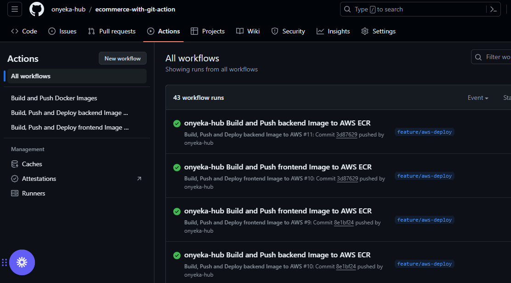

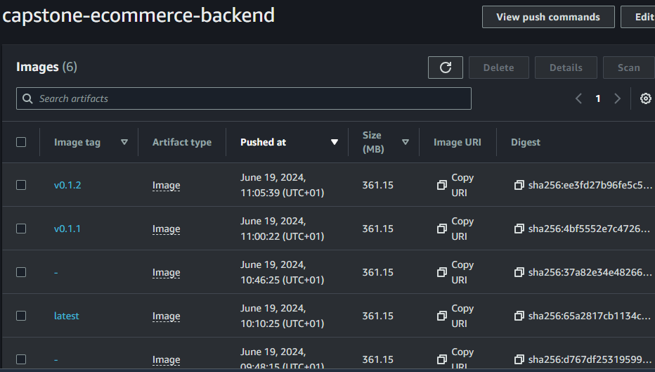

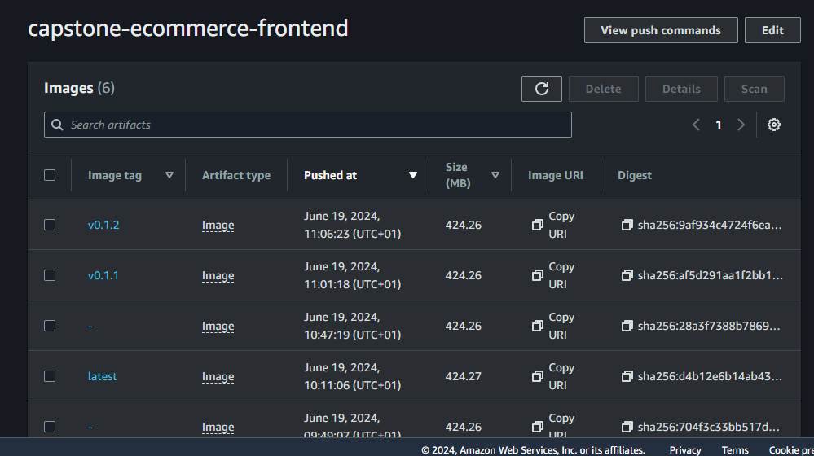


### Deploy to ECS

- Create ECS cluster: app_cluster

- Create task definition: Create task definition file .github/workflows/td-frontend.json. Copy the json configuration from the console as below and put into .github/workflows/td-frontend.json file
```json
{
    "taskDefinitionArn": "arn:aws:ecs:eu-west-2:072824470958:task-definition/app",
    "containerDefinitions": [
        {
            "name": "frontend",
            "image": "072824470958.dkr.ecr.eu-west-2.amazonaws.com/capstone-ecommerce-frontend:v0.1.2",
            "cpu": 0,
            "portMappings": [
                {
                    "name": "frontend-3000-tcp",
                    "containerPort": 3000,
                    "hostPort": 3000,
                    "protocol": "tcp",
                    "appProtocol": "http"
                }
            ],
            "essential": true,
            "environment": [],
            "environmentFiles": [],
            "mountPoints": [],
            "volumesFrom": [],
            "ulimits": [],
            "systemControls": []
        }
    ],
    "family": "app",
    "taskRoleArn": "arn:aws:iam::072824470958:role/ecsTaskExecutionRole",
    "executionRoleArn": "arn:aws:iam::072824470958:role/ecsTaskExecutionRole",
    "networkMode": "awsvpc",
    "volumes": [],
    "status": "ACTIVE",
    "requiresAttributes": [
        {
            "name": "com.amazonaws.ecs.capability.ecr-auth"
        },
        {
            "name": "com.amazonaws.ecs.capability.task-iam-role"
        },
        {
            "name": "ecs.capability.execution-role-ecr-pull"
        },
        {
            "name": "com.amazonaws.ecs.capability.docker-remote-api.1.18"
        },
        {
            "name": "ecs.capability.task-eni"
        }
    ],
    "placementConstraints": [],
    "compatibilities": [
        "EC2",
        "FARGATE"
    ],
    "requiresCompatibilities": [
        "FARGATE"
    ],
    "cpu": "1024",
    "memory": "3072",
    "runtimePlatform": {
        "cpuArchitecture": "X86_64",
        "operatingSystemFamily": "LINUX"
    },
    "registeredAt": "2024-06-25T15:05:07.564Z",
    "registeredBy": "arn:aws:iam::072824470958:user/onyeka@darey.io",
    "tags": []
}
```

- Create ECS service: app_service

- Update the workflow yaml file .github/workflows/frontend-ci.yml with below snippet

```yaml
name: Build, Push and Deploy frontend Image to AWS
run-name: ${{ github.actor }} Build and Push frontend Image to AWS ECR and ECS

# Trigger only when changes are made in the app/frontend directory for PR and there is a push 
# and PR on the main branch.
on:
  push:
    branches: 
      - main
  pull_request:
    paths: 
      - 'app/frontend/**'

env:
  AWS_REGION: eu-west-2
  ECS_CLUSTER: app_cluster
  CONTAINER_NAME: frontend
  ECS_SERVICE: app_service
  ECS_TD: .github/workflows/td-frontend.json

jobs:
  build-and-push:
    name: Build and Push to ECR and ECS
    runs-on: ubuntu-latest
    environment: dev
    steps:
    - name: Checkout
      uses: actions/checkout@v2

    - name: Set up Node.js
      uses: actions/setup-node@v2
      with:
        node-version: '14'
        cache: 'npm'
        cache-dependency-path: '**/package-lock.json'

    # Install frontend dependencies
    - name: Install frontend dependencies
      run: npm install
      working-directory: app/frontend

    - name: Configure AWS credentials
      uses: aws-actions/configure-aws-credentials@v1
      with:
        aws-access-key-id: ${{ secrets.AWS_ACCESS_KEY_ID }}
        aws-secret-access-key: ${{ secrets.AWS_SECRET_ACCESS_KEY }}
        aws-region: ${{ env.AWS_REGION }}

    - name: Login to Amazon ECR
      id: login-ecr
      uses: aws-actions/amazon-ecr-login@v1

    - name: Automatic Tagging of Releases
      id: increment-git-tag
      run: |
        bash ./build/git_update.sh -v patch

    - name: Build, Tag, and Push frontend Image to Amazon ECR
      id: build-image
      env:
        ECR_REGISTRY: ${{ steps.login-ecr.outputs.registry }}
        ECR_REPOSITORY: capstone-ecommerce-frontend
        IMAGE_TAG: ${{ steps.increment-git-tag.outputs.git-tag }}
      run: |
        docker build -t $ECR_REGISTRY/$ECR_REPOSITORY:$IMAGE_TAG .
        docker push $ECR_REGISTRY/$ECR_REPOSITORY:$IMAGE_TAG
        echo "::set-output name=image::$ECR_REGISTRY/$ECR_REPOSITORY:$IMAGE_TAG"
      working-directory: app/frontend  

    - name: Fill in the new image ID in the Amazon ECS task definition
      id: task-def-1
      uses: aws-actions/amazon-ecs-render-task-definition@v1
      with:
        task-definition: ${{ env.ECS_TD }}
        container-name: ${{ env.CONTAINER_NAME }}
        image: ${{ steps.build-image.outputs.image }}

    - name: Deploy Amazon ECS task definition
      uses: aws-actions/amazon-ecs-deploy-task-definition@v1
      with:
        task-definition: ${{ steps.task-def-1.outputs.task-definition }}
        service: ${{ env.ECS_SERVICE }}
        cluster: ${{ env.ECS_CLUSTER }}
        wait-for-service-stability: true
```

- For dividing the above workflow into two jobs, update the workflow yaml file .github/workflows/frontend-ci.yml with below snippet
```yaml
name: Build, Push, and Deploy Frontend Image to AWS
run-name: ${{ github.actor }} Build and Push Frontend Image to AWS ECR and ECS

# Trigger only when changes are made in the app/frontend directory for PR and there is a push 
# on the main branch.
on:
  push:
    branches: 
      - main
    paths:
      - 'app/frontend/**'
  pull_request:
    paths: 
      - 'app/frontend/**'

env:
  AWS_REGION: eu-west-2
  ECS_CLUSTER: app_cluster
  CONTAINER_NAME: frontend
  ECS_SERVICE: app_service
  ECS_TD: .github/workflows/td-frontend.json

jobs:
  build-and-push:
    name: Build and Push to ECR and ECS
    runs-on: ubuntu-latest
    environment: dev

    steps:
      - name: Checkout code
        uses: actions/checkout@v2

      - name: Set up Node.js
        uses: actions/setup-node@v2
        with:
          node-version: '14'
          cache: 'npm'
          cache-dependency-path: '**/package-lock.json'

      - name: Install frontend dependencies
        run: npm install
        working-directory: app/frontend

      - name: Configure AWS credentials
        uses: aws-actions/configure-aws-credentials@v1
        with:
          aws-access-key-id: ${{ secrets.AWS_ACCESS_KEY_ID }}
          aws-secret-access-key: ${{ secrets.AWS_SECRET_ACCESS_KEY }}
          aws-region: ${{ env.AWS_REGION }}

      - name: Login to Amazon ECR
        id: login-ecr
        uses: aws-actions/amazon-ecr-login@v1

      - name: Automatic tagging of releases
        id: increment-git-tag
        run: bash ./build/git_update.sh -v patch

      - name: Build, tag, and push frontend image to Amazon ECR
        id: build-image
        env:
          ECR_REGISTRY: ${{ steps.login-ecr.outputs.registry }}
          ECR_REPOSITORY: capstone-ecommerce-frontend
          IMAGE_TAG: ${{ steps.increment-git-tag.outputs.git-tag }}
        run: |
          docker build --cache-from $ECR_REGISTRY/$ECR_REPOSITORY:latest -t $ECR_REGISTRY/$ECR_REPOSITORY:$IMAGE_TAG .
          docker push $ECR_REGISTRY/$ECR_REPOSITORY:$IMAGE_TAG
          echo "::set-output name=image::$ECR_REGISTRY/$ECR_REPOSITORY:$IMAGE_TAG"
        working-directory: app/frontend

  deploy-to-ecs:
    needs: build-and-push
    runs-on: ubuntu-latest

    steps:
      - name: Checkout code
        uses: actions/checkout@v2

      - name: Configure AWS credentials
        uses: aws-actions/configure-aws-credentials@v1
        with:
          aws-access-key-id: ${{ secrets.AWS_ACCESS_KEY_ID }}
          aws-secret-access-key: ${{ secrets.AWS_SECRET_ACCESS_KEY }}
          aws-region: ${{ env.AWS_REGION }}

      - name: Login to Amazon ECR
        id: login-ecr
        uses: aws-actions/amazon-ecr-login@v1
  
      - name: Automatic tagging of releases
        id: increment-git-tag
        run: bash ./build/git_update.sh -v patch

      - name: Fill in the new image ID in the Amazon ECS task definition
        id: task-def-1
        env:
          ECR_REGISTRY: ${{ steps.login-ecr.outputs.registry }}
          ECR_REPOSITORY: capstone-ecommerce-frontend
          IMAGE_TAG: ${{ steps.increment-git-tag.outputs.git-tag }}
        uses: aws-actions/amazon-ecs-render-task-definition@v1
        with:
          task-definition: ${{ env.ECS_TD }}
          container-name: ${{ env.CONTAINER_NAME }}
          image: ${{ env.ECR_REGISTRY }}/${{ env.ECR_REPOSITORY }}:${{ env.IMAGE_TAG }}

      - name: Deploy Amazon ECS task definition
        uses: aws-actions/amazon-ecs-deploy-task-definition@v1
        with:
          task-definition: ${{ steps.task-def-1.outputs.task-definition }}
          service: ${{ env.ECS_SERVICE }}
          cluster: ${{ env.ECS_CLUSTER }}
          wait-for-service-stability: true
```

- Test GitHub Actions. Create initial commit
```sh
git add .
git commit -m 'init commit'
git push
```

- Check ECR and ECS

## References
[Anton Putra](https://github.com/antonputra/lesson-086)

[Anton Putra video on deploying to ECR](https://www.youtube.com/watch?v=Hv5UcBYseus)

[Anton Putra documentation on deploying to ECR](https://github.com/antonputra/tutorials/tree/main/lessons/086)

[Amazon Elasctic Container Registry (ECR) from Emad Zaamout](https://www.youtube.com/watch?v=_IhseyrjBZQ&t=5s)
[Base Image Github URL from Emad Zaamout](https://github.com/emad-zaamout/php-fpm-nginx-base-image)
[Workflow syntax for GitHub Actions](https://docs.github.com/en/actions/learn-github-actions/workflow-syntax-for-github-actions)

[Metadata syntax for GitHub Actions](https://docs.github.com/en/actions/creating-actions/metadata-syntax-for-github-actions)

#### For Build, Push to ECR, and Deploy to Elastic Beanstalk

Add the following secrets to your GitHub repository:
- `AWS_ACCESS_KEY_ID`
- `AWS_SECRET_ACCESS_KEY`
- `AWS_REGION`
- `ECR_REPOSITORY_EXPRESS`
- `ECR_REPOSITORY_REACT`
- `EB_APPLICATION_NAME`
- `EB_ENVIRONMENT_NAME`

#### GitHub Actions Workflow: `.github/workflows/deploy.yml`

```yaml
name: Build, Push to ECR, and Deploy to Elastic Beanstalk

on:
  push:
    branches:
      - main

jobs:
  build-and-deploy:
    runs-on: ubuntu-latest

    steps:
      - name: Checkout code
        uses: actions/checkout@v2

      - name: Set up Docker Buildx
        uses: docker/setup-buildx-action@v2

      - name: Log in to Amazon ECR
        id: login-ecr
        uses: aws-actions/amazon-ecr-login@v1

      - name: Build and push Express app to ECR
        env:
          ECR_REPOSITORY: ${{ secrets.ECR_REPOSITORY_EXPRESS }}
          AWS_REGION: ${{ secrets.AWS_REGION }}
        run: |
          IMAGE_TAG=latest
          docker build -t $ECR_REPOSITORY:latest ./backend
          docker tag $ECR_REPOSITORY:latest $AWS_ACCOUNT_ID.dkr.ecr.$AWS_REGION.amazonaws.com/$ECR_REPOSITORY:latest
          docker push $AWS_ACCOUNT_ID.dkr.ecr.$AWS_REGION.amazonaws.com/$ECR_REPOSITORY:latest

      - name: Build and push React app to ECR
        env:
          ECR_REPOSITORY: ${{ secrets.ECR_REPOSITORY_REACT }}
          AWS_REGION: ${{ secrets.AWS_REGION }}
        run: |
          IMAGE_TAG=latest
          docker build -t $ECR_REPOSITORY:latest ./frontend
          docker tag $ECR_REPOSITORY:latest $AWS_ACCOUNT_ID.dkr.ecr.$AWS_REGION.amazonaws.com/$ECR_REPOSITORY:latest
          docker push $AWS_ACCOUNT_ID.dkr.ecr.$AWS_REGION.amazonaws.com/$ECR_REPOSITORY:latest

      - name: Deploy to Elastic Beanstalk
        env:
          AWS_ACCESS_KEY_ID: ${{ secrets.AWS_ACCESS_KEY_ID }}
          AWS_SECRET_ACCESS_KEY: ${{ secrets.AWS_SECRET_ACCESS_KEY }}
          AWS_REGION: ${{ secrets.AWS_REGION }}
          EB_APPLICATION_NAME: ${{ secrets.EB_APPLICATION_NAME }}
          EB_ENVIRONMENT_NAME: ${{ secrets.EB_ENVIRONMENT_NAME }}
        run: |
          zip -r deploy.zip Dockerrun.aws.json
          aws elasticbeanstalk create-application-version --application-name $EB_APPLICATION_NAME --version-label latest --source-bundle S3Bucket="my-bucket",S3Key="deploy.zip"
          aws elasticbeanstalk update-environment --environment-name $EB_ENVIRONMENT_NAME --version-label latest
```

#### Explanation

1. **Triggers**: The workflow is triggered on any push to the `main` branch.
2. **Jobs**:
   - **Checkout code**: Uses `actions/checkout` to clone the repository.
   - **Set up Docker Buildx**: Uses `docker/setup-buildx-action` to set up Docker Buildx.
   - **Log in to Amazon ECR**: Uses `aws-actions/amazon-ecr-login` to authenticate Docker with Amazon ECR.
   - **Build and push Express app to ECR**: Builds the Docker image for your Express app and pushes it to Amazon ECR.
   - **Build and push React app to ECR**: Builds the Docker image for your React app and pushes it to Amazon ECR.
   - **Deploy to Elastic Beanstalk**: Creates a new application version and updates the environment in Elastic Beanstalk using the AWS CLI.

#### Additional Steps

1. **Elastic Beanstalk Configuration**:
   - Create a `Dockerrun.aws.json` file in the root of your repository with the following content:
     ```json
     {
       "AWSEBDockerrunVersion": 2,
       "containerDefinitions": [
         {
           "name": "express",
           "image": "<your-aws-account-id>.dkr.ecr.<your-region>.amazonaws.com/<your-express-repo>:latest",
           "essential": true,
           "portMappings": [
             {
               "hostPort": 4000,
               "containerPort": 4000
             }
           ]
         },
         {
           "name": "react",
           "image": "<your-aws-account-id>.dkr.ecr.<your-region>.amazonaws.com/<your-react-repo>:latest",
           "essential": true,
           "portMappings": [
             {
               "hostPort": 80,
               "containerPort": 80
             }
           ]
         }
       ]
     }
     ```
   - Replace placeholders with your actual AWS account ID, region, and repository names.

2. **Amazon S3 Bucket**:
   - Make sure to specify an S3 bucket in the `Deploy to Elastic Beanstalk` step. This is required to upload the `Dockerrun.aws.json` file as a source bundle.

3. **IAM Permissions**:
   - Ensure your IAM user has the necessary permissions to create and update application versions and environments in Elastic Beanstalk.

### Notes

- Make sure to replace the placeholders in the workflow file with your actual AWS account ID, region, and ECR repository names.
- Ensure that your `Dockerrun.aws.json` file is correctly configured to point to the right ECR image URLs.
- You might need to adjust the workflow to fit your specific application architecture and deployment strategy.