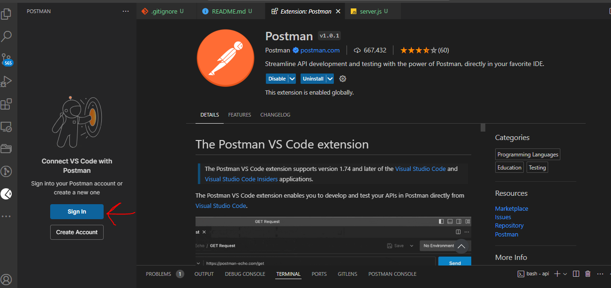
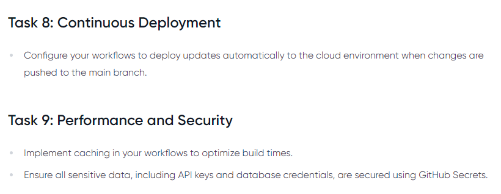

# Capstone Project: Ecommerce Application CI/CD Pipeline
## Ecommerce with Git Action


The github repo for this project is [here](https://github.com/onyeka-hub/ecommerce-with-git-action.git)

## Set Up

### Creating Backend Application

To run the Node.js/Express backend application and the React frontend application, you'll need to follow these steps:

Make sure you have Node.js installed on your system. You can download it from the official Node.js website.

- Go to github and create a repository called `ecommerce-with-git-action`
- Clone the repository on local machine and create two directories: api and app

Both directories are going to contain javascript code with api being the backend and app being the frontend.


Install the required dependencies for the backend application

- Move into the api directory and initialize the directory with 
```
npm init -y
```

- Install express and cors dependencies with the below commands. Express is a backend framework built on nodejs used for building backend apis

```
npm install express
npm install cors
```


- In the api directory, create a file called server.js. This file contains the backend code for the ecommerce application

```
const express = require('express');
const cors = require('cors');

const app = express();

// Enable CORS for all routes
app.use(cors());

const PORT = process.env.PORT || 4000;

// Middleware to parse JSON bodies
app.use(express.json());

// Dummy database (replace with a real database in a production environment)
let products = [];

// Routes
// Get all products
app.get('/products', (req, res) => {
    res.json(products);
});

// Get a single product by ID
app.get('/products/:id', (req, res) => {
    const productId = req.params.id;
    const product = products.find(prod => prod.id === productId);
    if (!product) {
        return res.status(404).json({ message: 'Product not found' });
    }
    res.json(product);
});

// Add a new product
app.post('/products', (req, res) => {
    const { name, price } = req.body;
    const newProduct = {
        id: String(products.length + 1),
        name,
        price
    };
    products.push(newProduct);
    res.status(201).json(newProduct);
});

// Update a product
app.put('/products/:id', (req, res) => {
    const productId = req.params.id;
    const { name, price } = req.body;
    const productIndex = products.findIndex(prod => prod.id === productId);
    if (productIndex === -1) {
        return res.status(404).json({ message: 'Product not found' });
    }
    products[productIndex] = {
        ...products[productIndex],
        name,
        price
    };
    res.json(products[productIndex]);
});

// Delete a product
app.delete('/products/:id', (req, res) => {
    const productId = req.params.id;
    products = products.filter(prod => prod.id !== productId);
    res.json({ message: 'Product deleted successfully' });
});

// Start the server
module.exports = app.listen(PORT, () => {
    console.log(`Server is running on port ${PORT}`);
});
```

- Now it is time to test the backend server. After the installation completes, start the backend server by running:

```
npm start
```
This command will start the server, and you should see a message indicating that the server is running on a specific port (e.g., Server is running on port 4000).


- Install POSTMAN extension on VSCODE and create an account to test the backend endpoint



- We will be testing one of the endpoints, the endpoint for adding a product and its price.

- On Postman create a collection > right click and create a new request > rename the request to "add_products" > add the localhost address "locaalhost:4000/products"

- Send in the name and price as a json body entry and click on send request
```
{
    "name": "laptop",
    "price": "1000"
}
```


You can also download and install postman application on your local machine


### Creating Test File for code

Create a test file called server.test.js inside api directory which tests the functionality of the backend code and ensures it behaves the way it should.
```
const request = require('supertest');
const app = require('./server'); 

let server;

beforeAll(async () => {
    // Start the server before running tests
    server = app.listen(3000);
  
    // Wait for the server to be listening (optional)
    await new Promise(resolve => server.on('listening', resolve));
  });
  
afterAll(async () => {
    // Close the server after all tests are done
    server.close();
  });

describe('API Endpoints', () => {
  let productId;

  // Test for adding a new product
  it('should add a new product', async () => {
    const res = await request(app)
      .post('/products')
      .send({ name: 'Test Product', price: 10.99 });
    
    expect(res.statusCode).toEqual(201);
    expect(res.body).toHaveProperty('id');
    productId = res.body.id;
  });

  // Test for getting all products
  it('should get all products', async () => {
    const res = await request(app).get('/products');
    
    expect(res.statusCode).toEqual(200);
    expect(Array.isArray(res.body)).toBeTruthy();
  });

  // Test for getting a single product
  it('should get a single product', async () => {
    const res = await request(app).get(`/products/${productId}`);
    
    expect(res.statusCode).toEqual(200);
    expect(res.body).toHaveProperty('name', 'Test Product');
  });

  // Test for updating a product
  it('should update a product', async () => {
    const res = await request(app)
      .put(`/products/${productId}`)
      .send({ name: 'Updated Product', price: 15.99 });
    
    expect(res.statusCode).toEqual(200);
    expect(res.body).toHaveProperty('name', 'Updated Product');
  });

  // Test for deleting a product
  it('should delete a product', async () => {
    const res = await request(app).delete(`/products/${productId}`);
    
    expect(res.statusCode).toEqual(200);
    expect(res.body).toHaveProperty('message', 'Product deleted successfully');
  });
});
```

- Install jest and supertest which are tools for carrying out testing of javascript codebases
```
npm install --save-dev jest supertest
```


- To be able to run tests as npm test it is required to set up package.json file to execute the test. Edit the package.json file to point the test to the server.test.js and run the npm test command


```
npm test

> api@1.0.0 test
> jest server.test.js


  ●  Cannot log after tests are done. Did you forget to wait for something async in your test?
    Attempted to log "Server is running on port 4000".

    

      at console.log (node_modules/@jest/console/build/CustomConsole.js:141:10)
      at Server.<anonymous> (server.js:80:11)

 FAIL  ./server.test.js
  ● API Endpoints › should add a new product                                                                                    
                                                                                                                                
    Listen method has been called more than once without closing.

       6 | beforeAll(async () => {
       7 |     // Start the server before running tests
    >  8 |     server = app.listen(3000);
         |                  ^
       9 |   
      10 |     // Wait for the server to be listening (optional)
      11 |     await new Promise(resolve => server.on('listening', resolve));

      at Object.listen (server.test.js:8:18)

  ● API Endpoints › should get all products

    Listen method has been called more than once without closing.

       6 | beforeAll(async () => {
       7 |     // Start the server before running tests
    >  8 |     server = app.listen(3000);
         |                  ^
       9 |   
      10 |     // Wait for the server to be listening (optional)
      11 |     await new Promise(resolve => server.on('listening', resolve));

      at Object.listen (server.test.js:8:18)

  ● API Endpoints › should get a single product

    Listen method has been called more than once without closing.

       6 | beforeAll(async () => {
       7 |     // Start the server before running tests
    >  8 |     server = app.listen(3000);
         |                  ^
       9 |   
      10 |     // Wait for the server to be listening (optional)
      11 |     await new Promise(resolve => server.on('listening', resolve));

      at Object.listen (server.test.js:8:18)

  ● API Endpoints › should update a product

    Listen method has been called more than once without closing.

       6 | beforeAll(async () => {
       7 |     // Start the server before running tests
    >  8 |     server = app.listen(3000);
         |                  ^
       9 |   
      10 |     // Wait for the server to be listening (optional)
      11 |     await new Promise(resolve => server.on('listening', resolve));

      at Object.listen (server.test.js:8:18)

  ● API Endpoints › should delete a product

    Listen method has been called more than once without closing.

       6 | beforeAll(async () => {
       7 |     // Start the server before running tests
    >  8 |     server = app.listen(3000);
         |                  ^
       9 |   
      10 |     // Wait for the server to be listening (optional)
      11 |     await new Promise(resolve => server.on('listening', resolve));

      at Object.listen (server.test.js:8:18)


  ● Test suite failed to run

    TypeError: Cannot read properties of undefined (reading 'close')

      14 | afterAll(async () => {
      15 |     // Close the server after all tests are done
    > 16 |     server.close();
         |            ^
      17 |   });
      18 |
      19 | describe('API Endpoints', () => {

      at Object.close (server.test.js:16:12)

Test Suites: 1 failed, 1 total
Tests:       5 failed, 5 total
Snapshots:   0 total
Time:        1.797 s
Ran all test suites matching /server.test.js/i.
Jest did not exit one second after the test run has completed.

'This usually means that there are asynchronous operations that weren't stopped in your tests. Consider running Jest with `--detectOpenHandles` to troubleshoot this issue.
```

Updating the server.test.js file with the below snippet

```
const request = require('supertest');
const app = require('./server');

let server;

beforeAll((done) => {
  server = app.listen(4000, () => {
    console.log('Server is running on port 4000');
    done();
  });
});

afterAll((done) => {
  server.close(done);
});

describe('API Endpoints', () => {
  let productId;

  // Test for adding a new product
  it('should add a new product', async () => {
    const res = await request(server)
      .post('/products')
      .send({ name: 'Test Product', price: 10.99 });
    
    expect(res.statusCode).toEqual(201);
    expect(res.body).toHaveProperty('id');
    productId = res.body.id;
  });

  // Test for getting all products
  it('should get all products', async () => {
    const res = await request(server).get('/products');
    
    expect(res.statusCode).toEqual(200);
    expect(Array.isArray(res.body)).toBeTruthy();
  });

  // Test for getting a single product
  it('should get a single product', async () => {
    const res = await request(server).get(`/products/${productId}`);
    
    expect(res.statusCode).toEqual(200);
    expect(res.body).toHaveProperty('name', 'Test Product');
  });

  // Test for updating a product
  it('should update a product', async () => {
    const res = await request(server)
      .put(`/products/${productId}`)
      .send({ name: 'Updated Product', price: 15.99 });
    
    expect(res.statusCode).toEqual(200);
    expect(res.body).toHaveProperty('name', 'Updated Product');
  });

  // Test for deleting a product
  it('should delete a product', async () => {
    const res = await request(server).delete(`/products/${productId}`);
    
    expect(res.statusCode).toEqual(200);
    expect(res.body).toHaveProperty('message', 'Product deleted successfully');
  });
});
```

OUTPUT
```
$ npm test

> api@1.0.0 test
> jest server.test.js


  ●  Cannot log after tests are done. Did you forget to wait for something async in your test?
    Attempted to log "Server is running on port 4000".

    

      at console.log (node_modules/@jest/console/build/CustomConsole.js:141:10)
      at Server.<anonymous> (server.js:80:11)

 FAIL  ./server.test.js (6.293 s)
  ● API Endpoints › should add a new product                                                                                    
                                                                                                                                
    Listen method has been called more than once without closing.

       5 |
       6 | beforeAll((done) => {
    >  7 |   server = app.listen(4000, () => {
         |                ^
       8 |     console.log('Server is running on port 4000');
       9 |     done();
      10 |   });

      at Object.listen (server.test.js:7:16)

  ● API Endpoints › should get all products

    Listen method has been called more than once without closing.

       5 |
       6 | beforeAll((done) => {
    >  7 |   server = app.listen(4000, () => {
         |                ^
       8 |     console.log('Server is running on port 4000');
       9 |     done();
      10 |   });

      at Object.listen (server.test.js:7:16)

  ● API Endpoints › should get a single product

    Listen method has been called more than once without closing.

       5 |
       6 | beforeAll((done) => {
    >  7 |   server = app.listen(4000, () => {
         |                ^
       8 |     console.log('Server is running on port 4000');
       9 |     done();
      10 |   });

      at Object.listen (server.test.js:7:16)

  ● API Endpoints › should update a product

    Listen method has been called more than once without closing.

       5 |
       6 | beforeAll((done) => {
    >  7 |   server = app.listen(4000, () => {
         |                ^
       8 |     console.log('Server is running on port 4000');
       9 |     done();
      10 |   });

      at Object.listen (server.test.js:7:16)

  ● API Endpoints › should delete a product

    Listen method has been called more than once without closing.

       5 |
       6 | beforeAll((done) => {
    >  7 |   server = app.listen(4000, () => {
         |                ^
       8 |     console.log('Server is running on port 4000');
       9 |     done();
      10 |   });

      at Object.listen (server.test.js:7:16)


  ● Test suite failed to run

    TypeError: Cannot read properties of undefined (reading 'close')

      12 |
      13 | afterAll((done) => {
    > 14 |   server.close(done);
         |          ^
      15 | });
      16 |
      17 | describe('API Endpoints', () => {

      at Object.close (server.test.js:14:10)

Test Suites: 1 failed, 1 total                                                                                                  
Tests:       5 failed, 5 total                                                                                                  
Snapshots:   0 total
Time:        7.425 s
Ran all test suites matching /server.test.js/i.
Jest did not exit one second after the test run has completed.

'This usually means that there are asynchronous operations that weren't stopped in your tests. Consider running Jest with `--detectOpenHandles` to troubleshoot this issue.
```
### Setting up frontend

- Move into the app directory

- Here we need to create a react app and this can be achieved using the below
```
npx create-react-app frontend
```

A frontend directory will be created inside the app directory that contains the starter code for a simple react application. This app will run on port 3000 on the browser in the frontend dir, use `npm start` to start it.


#### Solution

The error above (`ENOENT: no such file or directory, lstat 'C:\Users\ONYEKA\AppData\Roaming\npm'`) indicates that npm is looking for a directory that doesn't exist. This could be due to a missing or corrupted npm installation. Here’s how you can resolve this issue:

#### Steps to Fix the Error

1. Recreate the Missing Directory

The error message indicates that the `C:\Users\ONYEKA\AppData\Roaming\npm` directory is missing. You can manually create this directory.

- **Create the missing directory**:
   - Open File Explorer.
   - Navigate to `C:\Users\ONYEKA\AppData\Roaming`.
   - Create a new folder named `npm`.

Alternatively, you can create the directory using the command line:

```sh
mkdir C:/Users/ONYEKA/AppData/Roaming/npm
```

2. Clear npm Cache

Sometimes, clearing the npm cache can resolve issues.
```sh
npm cache clean --force
```

3. Reinstall npm Global Packages

If you have any global npm packages, reinstall them after creating the missing directory.

- **Reinstall global packages**:
```sh
npm install -g npm
```

4. Create a React App Again

Now try creating a React app again using `create-react-app`.
```sh
npx create-react-app frontend
```


Cd into frontend directory and run the below command

```
npm start
```


### Populating Frontend with Ecommerce Code
In the frontend directory,inside the src directory create two directories: components and styles

In the components dir, create two files named "ProductForm.jsx and ProductList.jsx"

In the styles dir create two files "ProductFormStyles.js and ProductListStyles.js"
    
ProductForm
```
// ProductForm.jsx
import React, { useState } from 'react';
import { Container, FormContainer, Input, Button } from '../styles/ProductFormStyles';

const ProductForm = () => {
  const [product, setProduct] = useState({ name: '', price: '' });

  const handleSubmit = async (e) => {
    e.preventDefault();

    if (!product.name || !product.price){
        alert("Missing Fields detected")
        return; 
    }

    try {
      const response = await fetch("http://localhost:4000/products", {
        method: 'POST',
        headers: {
          "Content-Type": "application/json"
        },
        body: JSON.stringify(product)
      });

      if (!response.ok) {
        throw new Error('Failed to add product');
      }

      // Parse the response body as JSON
      const data = await response.json();

      console.log(data)


      setProduct({ name: '', price: '' });

    } catch (error) {
        console.error("Error adding product:", error.message);
        alert(`Error adding product ${error.message}`)
    }
  };

  return (
    <>     
            
// Add a Product

           setProduct({ ...product, name: e.target.value })}
          />
           setProduct({ ...product, price: e.target.value })}
          />
          Add Product
        
      
    
  );
};

export default ProductForm;
```

ProductList
```
// ProductList.jsx
import React, { useState, useEffect } from 'react';
import { ListingContainer, ProductList, ProductItem } from '../styles/ProductListStyles';

const ProductListing = () => {
  const [products, setProducts] = useState([]);

  useEffect(() => {
    const fetchData = async () => {
      try {
        const response = await fetch('http://localhost:4000/products');
        if (!response.ok) {
          throw new Error('Failed to fetch products');
        }
        const data = await response.json();
        setProducts(data);
      } catch (error) {
        console.error('Error fetching products:', error.message);
      }
    };

    fetchData();

    return () => {
      // Cleanup (if needed)
    };
  }, []);

  return (

// Products

        {products.map((product) => (
          
            {product.name} - ${product.price}
          
        ))}
      
    
  );
};

export default ProductListing;
```
 
ProductFormStyles
```
// ProductFormStyles.js
import styled from 'styled-components';

export const Container = styled.div`
  display: flex;
  justify-content: center;
  align-items: center;
  height: 100vh;
`;

export const FormContainer = styled.form`
  width: 600px;
  padding: 40px 20px;
  background-color: #fff;
  border-radius: 8px;
  box-shadow: 3px 10px 10px rgba(0, 0, 0, 0.1);
`;

export const Input = styled.input`
  margin-bottom: 15px;
  padding: 10px;
  width: 100%;
  border: 1px solid #ccc;
  border-radius: 4px;
  font-size: 16px;
`;

export const Button = styled.button`
  padding: 10px 15px;
  background-color: #007bff;
  color: #fff;
  border: none;
  border-radius: 4px;
  font-size: 16px;
  cursor: pointer;
  width: 100%;

  &:hover {
    background-color: #0056b3;
  }
`;
```
   
ProductListStyles
```
// ListingComponentStyles.js
import styled from 'styled-components';

export const ListingContainer = styled.div`
  width: 100%;
  max-width: 600px;
  margin: 0 auto;
  padding: 20px;
  border-radius: 8px;
  box-shadow: 3px 10px 10px rgba(0, 0, 0, 0.1);
`;

export const ProductList = styled.ul`
  list-style: none;
  padding: 0;
`;

export const ProductItem = styled.li`
  padding: 10px 0;
  border-bottom: 1px solid #ccc;

  &:last-child {
    border-bottom: none;
  }
`;
```

Cd into frontend directory and run the below command

```
npm start
```

### Contiinuous Integration Workflow
We will be creating a github actions that performs basic CICD processes. The github action will

- Install dependencies
- Run tests
- Build application

This will be done for both frontend and backend

In the root directory, create a directory called .github > inside it create a directory "workflows" > inside workflow create a file called build.yml

Add the following code to build.yaml
```
name: Full Stack CI

on:
  push:
    branches:
      - main
  pull_request:
    branches:
      - main

jobs:
  build:
    runs-on: ubuntu-latest

    steps:
      - name: Checkout code
        uses: actions/checkout@v2

      - name: Set up Node.js
        uses: actions/setup-node@v2
        with:
          node-version: '14'

      # Build the backend
      - name: Install backend dependencies
        run: npm install
        working-directory: api

      # Build the frontend
      - name: Install frontend dependencies
        run: npm install
        working-directory: app/frontend

      - name: Build frontend
        run: npm run build
        working-directory: app/frontend

    #   Run backend test
    #   - name: Run backend tests
    #     run: npm test
    #     working-directory: api
```

Make sure to adjust the routes and logic as per your specific requirements. Also, install the necessary dependencies (axios, supertest, jest, uuid, etc.) using npm or yarn before running the applications and tests.


- After the installation completes, start the backend server by running:

```
npm start
```
This command will start the server, and you should see a message indicating that the server is running on a specific port (e.g., Server is running on port 3001).

### Running the React Frontend Application:
Similarly, navigate to the directory containing your React application's package.json file (typically named client or src) in your terminal.

- Install the required dependencies for the frontend application by running:
```
npm init
npm install
npm install axios
npm install react
```

- After the installation completes, start the React development server by running:
```
npm start
```
This command will start the development server, and your default web browser will open automatically with the React application running. If it doesn't open automatically, you can access the application by navigating to http://localhost:3000 in your web browser.

### Running Unit Tests for the Backend Application:
To run the unit tests for the backend application, ensure you have installed the required testing dependencies (jest, supertest) by running npm install in the directory containing the server.test.js file.

- Run the following command to execute the unit tests:
```
npm install jest
npm install supertest
npm install --save-dev mocha

npm test
```

```
$ npm test

> api@1.0.0 test
> jest server.test.js


  ●  Cannot log after tests are done. Did you forget to wait for something async in your test?
    Attempted to log "Server is running on port 4000".

    

      at console.log (node_modules/@jest/console/build/CustomConsole.js:141:10)
      at Server.<anonymous> (server.js:80:11)

 FAIL  ./server.test.js (6.293 s)
  ● API Endpoints › should add a new product                                                                                    
                                                                                                                                
    Listen method has been called more than once without closing.

       5 |
       6 | beforeAll((done) => {
    >  7 |   server = app.listen(4000, () => {
         |                ^
       8 |     console.log('Server is running on port 4000');
       9 |     done();
      10 |   });

      at Object.listen (server.test.js:7:16)

  ● API Endpoints › should get all products

    Listen method has been called more than once without closing.

       5 |
       6 | beforeAll((done) => {
    >  7 |   server = app.listen(4000, () => {
         |                ^
       8 |     console.log('Server is running on port 4000');
       9 |     done();
      10 |   });

      at Object.listen (server.test.js:7:16)

  ● API Endpoints › should get a single product

    Listen method has been called more than once without closing.

       5 |
       6 | beforeAll((done) => {
    >  7 |   server = app.listen(4000, () => {
         |                ^
       8 |     console.log('Server is running on port 4000');
       9 |     done();
      10 |   });

      at Object.listen (server.test.js:7:16)

  ● API Endpoints › should update a product

    Listen method has been called more than once without closing.

       5 |
       6 | beforeAll((done) => {
    >  7 |   server = app.listen(4000, () => {
         |                ^
       8 |     console.log('Server is running on port 4000');
       9 |     done();
      10 |   });

      at Object.listen (server.test.js:7:16)

  ● API Endpoints › should delete a product

    Listen method has been called more than once without closing.

       5 |
       6 | beforeAll((done) => {
    >  7 |   server = app.listen(4000, () => {
         |                ^
       8 |     console.log('Server is running on port 4000');
       9 |     done();
      10 |   });

      at Object.listen (server.test.js:7:16)


  ● Test suite failed to run

    TypeError: Cannot read properties of undefined (reading 'close')

      12 |
      13 | afterAll((done) => {
    > 14 |   server.close(done);
         |          ^
      15 | });
      16 |
      17 | describe('API Endpoints', () => {

      at Object.close (server.test.js:14:10)

Test Suites: 1 failed, 1 total                                                                                                  
Tests:       5 failed, 5 total                                                                                                  
Snapshots:   0 total
Time:        7.425 s
Ran all test suites matching /server.test.js/i.
Jest did not exit one second after the test run has completed.

'This usually means that there are asynchronous operations that weren't stopped in your tests. Consider running Jest with `--detectOpenHandles` to troubleshoot this issue.
```

This will run the tests and display the results in your terminal.

That's it! Your Node.js/Express backend application and React frontend application should now be running, and you can interact with them in your web browser. Additionally, you've executed unit tests to ensure the correctness of the backend functionality.





