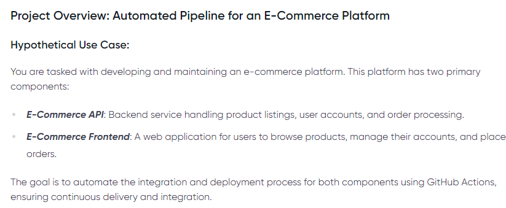
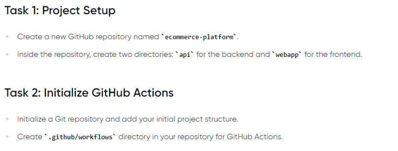
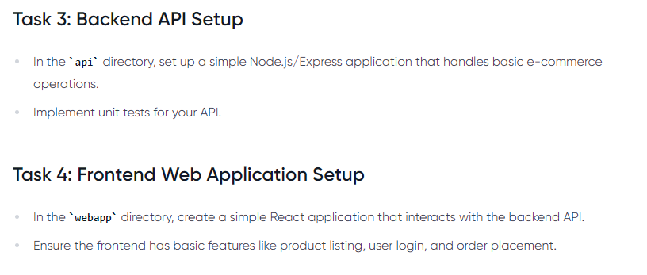
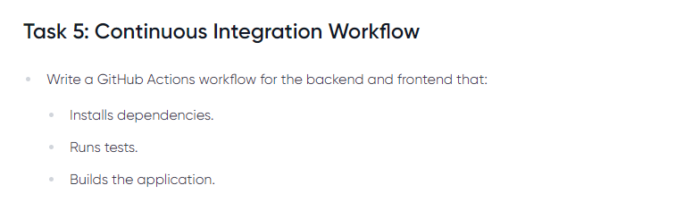
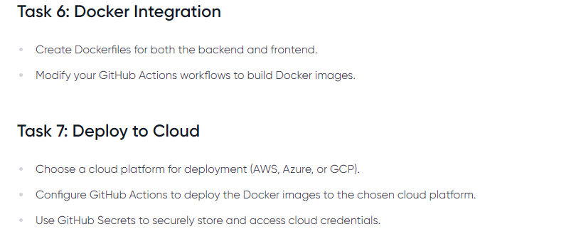
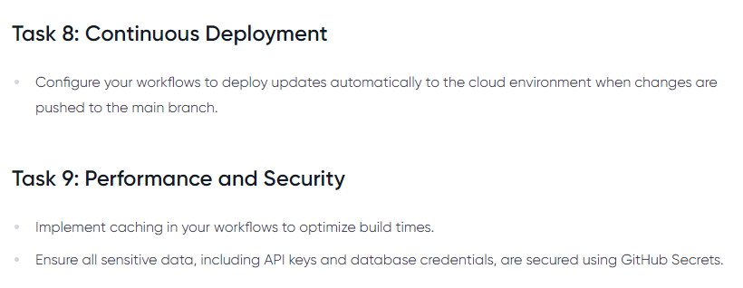
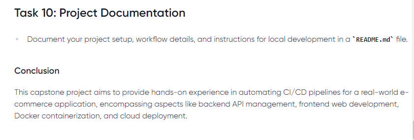
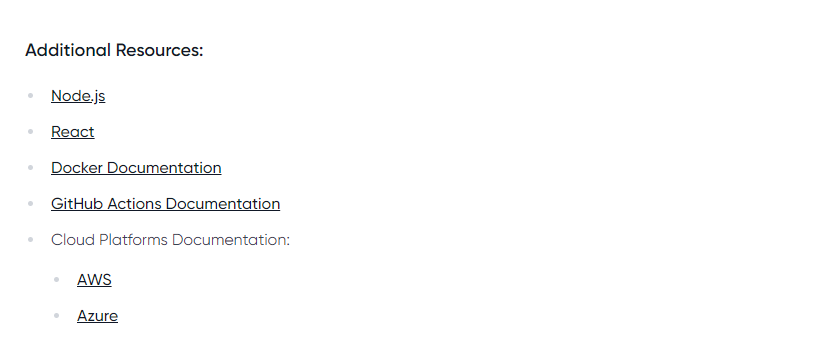

# ECOMMERCE WITH GIT ACTION



The github repo for this project is [here](https://github.com/onyeka-hub/ecommerce-with-git-action.git)





Make sure to adjust the routes and logic as per your specific requirements. Also, install the necessary dependencies (axios, supertest, jest, uuid, etc.) using npm or yarn before running the applications and tests.

To run the Node.js/Express backend application and the React frontend application, you'll need to follow these steps:

### Running the Node.js/Express Backend Application:
Make sure you have Node.js installed on your system. You can download it from the official Node.js website.

- Install the required dependencies for the backend application. In your terminal or command prompt, navigate to the directory containing the server.js file and run the following command:

```
npm init
npm install
npm install express
npm install uuid
```

- After the installation completes, start the backend server by running:

```
npm start
```
This command will start the server, and you should see a message indicating that the server is running on a specific port (e.g., Server is running on port 3001).

### Running the React Frontend Application:
Similarly, navigate to the directory containing your React application's package.json file (typically named client or src) in your terminal.

- Install the required dependencies for the frontend application by running:
```
npm init
npm install
npm install react
```

- After the installation completes, start the React development server by running:
```
npm start
```
This command will start the development server, and your default web browser will open automatically with the React application running. If it doesn't open automatically, you can access the application by navigating to http://localhost:3000 in your web browser.

### Running Unit Tests for the Backend Application:
To run the unit tests for the backend application, ensure you have installed the required testing dependencies (jest, supertest) by running npm install in the directory containing the server.test.js file.

- Run the following command to execute the unit tests:
```
npm test
```
This will run the tests and display the results in your terminal.

That's it! Your Node.js/Express backend application and React frontend application should now be running, and you can interact with them in your web browser. Additionally, you've executed unit tests to ensure the correctness of the backend functionality.











