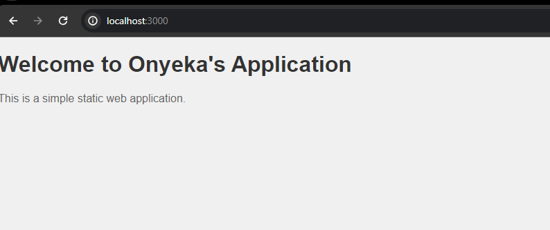

# Introduction to Continous Integration and Continous Deployment of a simple web application (node.js) using Github Action

This application will have a basic funtionality such as serving a static web page.

## Setting up the project

You can start by creating a new repository on github and cloning it down to your local meachine or create your project folder on your local machine and pushing it to github.

1. First, make sure you have Node.js and npm installed on your system.

- Download Node.js Installer: Visit the official Node.js website at [nodejs.org](https://nodejs.org/en/download/current), and download the latest LTS (Long-Term Support) version of Node.js for Windows. LTS versions are recommended for most users as they are stable and receive long-term support.

- Run the Installer: Once the installer file is downloaded, double-click it to run the installer.

- Setup Wizard: Follow the setup wizard instructions. Click "Next" on the welcome screen.
Read and accept the license agreement.

- Verify Installation:To verify that Node.js is installed correctly, open Command Prompt or PowerShell and run the following commands:
```
node -v
npm -v
```
These commands should print the versions of Node.js and npm (Node Package Manager) installed on your system, respectively.

2. Create a new directory for your project and navigate into it:

```
mkdir github-action-project
cd github-action-project
```

3. Initialize a new Node.js project:

```npm init -y```

4. Install Express.js as a dependency:

```npm install express```

5. Create a directory named public to store your static web application files (e.g., HTML, CSS, JavaScript):

```mkdir public```

6. Place your static web application files (e.g., index.html, styles.css, script.js) inside the public directory.

index.html
```
<!DOCTYPE html>
<html lang="en">
<head>
    <meta charset="UTF-8">
    <meta name="viewport" content="width=device-width, initial-scale=1.0">
    <title>Static Web Application</title>
    <link rel="stylesheet" href="styles.css">
</head>
<body>
    <h1>Welcome to Onyeka's Application</h1>
    <p>This is a simple static web application.</p>
    <script src="script.js"></script>
</body>
</html>
```

styles.css
```
body {
    font-family: Arial, sans-serif;
    background-color: #f0f0f0;
    margin: 0;
    padding: 0;
}

h1 {
    color: #333;
}

p {
    color: #666;
}
```

script.js
```
console.log('Script loaded!');
```

7. Create a file named server.js for your Express.js server in your project folder:

```
const express = require('express');
const path = require('path');

const app = express();
const PORT = process.env.PORT || 3000;

// Serve static files from the 'public' directory
app.use(express.static(path.join(__dirname, 'public')));

// Start the server
app.listen(PORT, () => {
    console.log(`Server is running on port ${PORT}`);
});
```

8. Run your Express.js server:

```node server.js
```



9. Github Action workflow. Create a `.github/workflows` directory in your project folder. Add a workflow file `node.js.yml`

```
name: GitHub Actions Demo
run-name: ${{ github.actor }} is testing out GitHub Actions 🚀
on: [push]
jobs:
  Explore-GitHub-Actions:
    runs-on: ubuntu-latest
    steps:
      - run: echo "🎉 The job was automatically triggered by a ${{ github.event_name }} event."
      - run: echo "🐧 This job is now running on a ${{ runner.os }} server hosted by GitHub!"
      - run: echo "🔎 The name of your branch is ${{ github.ref }} and your repository is ${{ github.repository }}."
      - name: Check out repository code
        uses: actions/checkout@v4
      - run: echo "💡 The ${{ github.repository }} repository has been cloned to the runner."
      - run: echo "🖥️ The workflow is now ready to test your code on the runner."
      - name: List files in the repository
        run: |
          ls ${{ github.workspace }}
      - run: echo "🍏 This job's status is ${{ job.status }}."
```

```
# Example: .github/workflows/node.js.yml

# Name of the workflow
name: Node.js CI

# Specifies when the workflow should be triggered
on:
# Triggers the workflow on 'push' events to the 'main' branch
push:
    branches: [ main ]
# Also triggers the workflow on 'pull_request' events targeting the 'main' branch
pull_request:
    branches: [ main ]

# Defines the jobs that the workflow will execute
jobs:
# Job identifier, can be any name (here it's 'build')
build:
    # Specifies the type of virtual host environment (runner) to use
    runs-on: ubuntu-latest

    # Strategy for running the jobs - this section is useful for testing across multiple environments
    strategy:
    # A matrix build strategy to test against multiple versions of Node.js
    matrix:
        node-version: [20, 16.x]

    # Steps represent a sequence of tasks that will be executed as part of the job
    steps:
    - # Checks-out your repository under $GITHUB_WORKSPACE, so the job can access it
    uses: actions/checkout@v2

    - # Sets up the specified version of Node.js
    name: Use Node.js ${{ matrix.node-version }}
    uses: actions/setup-node@v1
    with:
        node-version: ${{ matrix.node-version }}

    - # Installs node modules as specified in the project's package-lock.json
    run: npm ci

    - # This command will only run if a build script is defined in the package.json
    run: npm run build --if-present

    - # Runs tests as defined in the project's package.json
    run: npm test
```

- Using environmental variable
```
env:
  CUSTOM_VAR: value
  # Define an environment variable 'CUSTOM_VAR' at the workflow level.

jobs:
  example:
    runs-on: ubuntu-latest
    steps:
    - name: Use environment variable
      run: echo $CUSTOM_VAR
      # Access 'CUSTOM_VAR' in a step.
```

- Working with secrets
```
jobs:
  deploy:
    runs-on: ubuntu-latest
    steps:
    - name: Use secret
      run: |
        echo "Access Token: ${{ secrets.ACCESS_TOKEN }}"
        # Use 'ACCESS_TOKEN' secret defined in the repository settings.
```

- Conditional execution
```
jobs:
  conditional-job:
    runs-on: ubuntu-latest
    if: github.event_name == 'push' && github.ref == 'refs/heads/main'
    # The job runs only for push events to the 'main' branch.
    steps:
    - uses: actions/checkout@v2
```

- Using outputs and inputs between steps
```
jobs:
  example:
    runs-on: ubuntu-latest
    steps:
    - id: step-one
      run: echo "::set-output name=value::$(echo hello)"
      # Set an output named 'value' in 'step-one'.
    - id: step-two
      run: |
        echo "Received value from previous step: ${{ steps.step-one.outputs.value }}"
        # Access the output of 'step-one' in 'step-two'.
```

- Parallel and matrix builds
```
strategy:
  matrix:
    node-version: [12.x, 14.x, 16.x]
    # This matrix will run the job multiple times, once for each specified Node.js version (12.x, 14.x, 16.x).
    # The job will be executed separately for each version, ensuring compatibility across these versions.
```

- Managing build dependencies
```
- name: Cache Node Modules
  uses: actions/cache@v2
  with:
    path: ~/.npm
    key: ${{ runner.os }}-node-${{ hashFiles('**/package-lock.json') }}
    restore-keys: |
      ${{ runner.os }}-node-
  # This snippet caches the installed node modules based on the hash of the 'package-lock.json' file.
  # It helps in speeding up the installation process by reusing the cached modules when the 'package-lock.json' file hasn't changed.
```

- Adding code analysis tools
```
- name: Run Linter
  run: npx eslint .
  # 'npx eslint .' runs the ESLint tool on all the files in your repository.
  # ESLint is a static code analysis tool used to identify problematic patterns in JavaScript code.
```

10. Introduction to deployment pipeline

- Automating versioning in CI/CD. Implement automated versioning using github actions to increment version numbers automatically based on code changes. This action will automatically increment the patch version and create a new tag each time changes are pushed to the main branch.
```
name: Bump version and tag
on:
  push:
    branches:
      - main

jobs:
  build:
    name: Create Tag
    runs-on: ubuntu-latest
    steps:
      - name: Checkout code
        uses: actions/checkout@v2
        # The checkout action checks out your repository under $GITHUB_WORKSPACE, so your workflow can access it.

      - name: Bump version and push tag
        uses: anothrNick/github-tag-action@1.26.0
        env:
          GITHUB_TOKEN: ${{ secrets.GITHUB_TOKEN }}
          DEFAULT_BUMP: patch
        # This action automatically increments the patch version and tags the commit.
        # 'DEFAULT_BUMP' specifies the type of version bump (major, minor, patch).
```

- Creating and managing releases. Setup a github action to create a new release whenever a new tag is pushed to the repository. The `actions/create-release@v1` action is used to create a release on github. It uses the teg that triggered the workflow to name and label the release.
```
on:
  push:
    tags:
      - '*'

jobs:
  build:
    name: Create Release
    runs-on: ubuntu-latest
    steps:
      - name: Checkout code
        uses: actions/checkout@v2
        # Checks out the code in the tag that triggered the workflow.

      - name: Create Release
        id: create_release
        uses: actions/create-release@v1
        env:
          GITHUB_TOKEN: ${{ secrets.GITHUB_TOKEN }}
        with:
          tag_name: ${{ github.ref }}
          release_name: Release ${{ github.ref }}
          # This step creates a new release in GitHub using the tag name.
```

- Setup github action for deployment. This workflow deploys your application to AWS when changes are pushed to the main branch.
```
name: Deploy to AWS
on:
  push:
    branches:
      - main
  # This workflow triggers on a push to the 'main' branch.

jobs:
  deploy:
    runs-on: ubuntu-latest
    # Specifies the runner environment.

    steps:
    - name: Checkout code
      uses: actions/checkout@v2
      # Checks out your repository under $GITHUB_WORKSPACE.

    - name: Set up AWS credentials
      uses: aws-actions/configure-aws-credentials@v1
      with:
        aws-access-key-id: ${{ secrets.AWS_ACCESS_KEY_ID }}
        aws-secret-access-key: ${{ secrets.AWS_SECRET_ACCESS_KEY }}
        aws-region: us-west-2
      # Configures AWS credentials from GitHub secrets.

    - name: Deploy to AWS
      run: |
        # Add your deployment script here.
        # For example, using AWS CLI commands to deploy.
```

