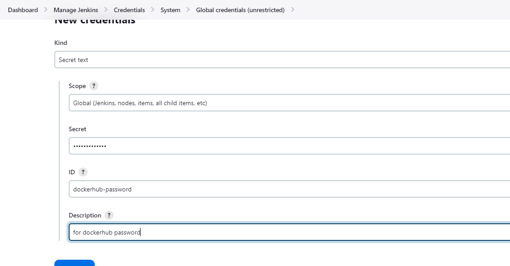

# AUTOMATING DEPLOYMENT OF AN E-CORMMERCE WEBSITE


## STEPS


Use the jenkins-script.sh to install jenkins on ubuntu

Use the ~\darey.io-capstone-projects\containerization-orchestration-core-3-step-17\docker-ubuntu-installation.sh for installing docker on the jenkins server.

 

Use this for creating the webhook : `http://13.40.219.176:8080/github-webhook/`


For testing our webhook, let us use the Jenkinsfile below
```
pipeline {
    agent any

  stages {
    stage("Initial cleanup"){
      steps {
        dir("${WORKSPACE}") {
          deleteDir()
        }
      }
    }
    
    stage('Build') {
      steps {
        script {
          sh 'echo "Building Stage"'
        }
      }
    }

    stage('Test') {
      steps {
        script {
          sh 'echo "Testing Stage"'
        }
      }
    }

    stage('Package') {
      steps {
        script {
          sh 'echo "Packaging Stage"'
        }
      }
    }

    stage('Deploy') {
      steps {
        script {
          sh 'echo "Deploying Stage"'
        }
      }
    }

    stage("Clean up workspace after build") {
          steps {
            cleanWs()
            }
    }
  }
}
```


- To build the image, update the Jenkinsfile with the below snippet

```
pipeline {
    agent any
    
    environment {
        DOCKER_IMAGE = "nginx-onyeka-app:0.2"
        DOCKERFILE_PATH = "${WORKSPACE}/containerization-orchestration-core-3-step-17/Dockerfile" // Path to your Dockerfile
    }

    stages {
        stage("Initial cleanup") {
          steps {
            dir("${WORKSPACE}") {
              deleteDir()
            }
          }
        }
    
        stage('Checkout') {
            steps {
                checkout scmGit(branches: [[name: '*/main']], extensions: [], userRemoteConfigs: [[credentialsId: 'github-password', url: 'https://github.com/onyeka-hub/darey.io-capstone-projects.git']])
            }
        }
        
        stage('Build Docker Image') {
            steps {
                script {
                    // Build the Docker image
                    sh "docker build -t ${DOCKER_IMAGE} -f ${DOCKERFILE_PATH} ."
                }
            }
        }       
    }
}
```

- Replace 'your-docker-image-name' with the name of your Docker image.

- Set DOCKERFILE_PATH to the path of your Dockerfile relative to the repository root.

- Replace 'https://github.com/your/repository.git' with the URL of your Git repository.

Blocker


Solution

The error message indicates that the Jenkins user doesn't have permission to access the Docker daemon socket (/var/run/docker.sock). This is because the Jenkins user doesn't have the necessary permissions to interact with Docker.

To fix this issue, you need to grant Jenkins permission to access the Docker daemon socket. You can do this by adding the Jenkins user to the Docker group.

Here's how you can do it. SSH into your Jenkins server. Run the following command to add the Jenkins user to the Docker group.

```
sudo usermod -aG docker jenkins
# After adding the Jenkins user to the Docker group, restart the Jenkins service to apply the changes

sudo systemctl restart jenkins
```

- To build and run the image, update the Jenkinsfile with the below snippet

```
pipeline {
    agent any
    
    environment {
        DOCKER_IMAGE = "nginx-onyeka-app:0.2"
        DOCKERFILE_PATH = "${WORKSPACE}/containerization-orchestration-core-3-step-17/Dockerfile" // Path to your Dockerfile
        CONTAINER_NAME = "nginx-onyeka-app"
        PORT_MAPPING = '8085:80' // Port mapping for container (host_port:container_port)
    }

    stages {
        stage("Initial cleanup") {
          steps {
            dir("${WORKSPACE}") {
              deleteDir()
            }
          }
        }
    
        stage('Checkout') {
            steps {
                checkout scmGit(branches: [[name: '*/main']], extensions: [], userRemoteConfigs: [[credentialsId: 'github-password', url: 'https://github.com/onyeka-hub/darey.io-capstone-projects.git']])
            }
        }
        
        stage('Build Docker Image') {
            steps {
                script {
                    // Build the Docker image
                    sh "docker build -t ${DOCKER_IMAGE} -f ${DOCKERFILE_PATH} ."
                }
            }
        }

        stage('Run Docker Container') {
            steps {
                script {
                    // Run the Docker container
                    sh "docker run -d --name ${CONTAINER_NAME} -p ${PORT_MAPPING} ${DOCKER_IMAGE}"
                }
            }
        }       
    }
}
```


- To build, run the image and push to dockerhub, update the Jenkinsfile with the below snippet

```
pipeline {
    agent any
    
    environment {
        DOCKER_IMAGE = "nginx-onyeka-app"
        DOCKERFILE_PATH = "${WORKSPACE}/containerization-orchestration-core-3-step-17/Dockerfile" // Path to your Dockerfile
        CONTAINER_NAME = "nginx-onyeka-app"
        PORT_MAPPING = '8085:80' // Port mapping for container (host_port:container_port)
        DOCKERHUB_PASSWORD = credentials('dockerhub-password')
        DOCKERHUB_USERNAME = "onyekaonu"
        DOCKER_TAG = "0.2"
    }

    stages {
        stage("Initial cleanup") {
          steps {
            dir("${WORKSPACE}") {
              deleteDir()
            }
          }
        }
    
        stage('Checkout') {
            steps {
                checkout scmGit(branches: [[name: '*/main']], extensions: [], userRemoteConfigs: [[credentialsId: 'github-password', url: 'https://github.com/onyeka-hub/darey.io-capstone-projects.git']])
            }
        }
        
        stage('Build Docker Image') {
            steps {
                script {
                    // Build the Docker image
                    sh "docker build -t ${DOCKER_IMAGE} -f ${DOCKERFILE_PATH} ."
                }
            }
        }

        stage('Run Docker Container') {
            steps {
                script {
                    // Run the Docker container
                    sh "docker run -d --name ${CONTAINER_NAME} -p ${PORT_MAPPING} ${DOCKER_IMAGE}"
                }
            }
        }

        stage('Tag Docker Image') {
            steps {
                script {
                    // Tag the Docker image
                    sh "docker tag ${DOCKER_IMAGE} ${DOCKERHUB_USERNAME}/${DOCKER_IMAGE}:${DOCKER_TAG}"
                }
            }
        }

        stage('Push to Docker Hub') {
            steps {
                script {
                    // Login to Docker Hub
                    sh "docker login -u ${DOCKERHUB_USERNAME} -p ${DOCKERHUB_PASSWORD}"
                    // Push the Docker image to Docker Hub
                    sh "docker push ${DOCKERHUB_USERNAME}/${DOCKER_IMAGE}:${DOCKER_TAG}"
                }
            }
        }

    }
}
```

- Create a credentials (secret text) for the dockerhub password and specify the Docker Hub password as Jenkins credentials IDs (dockerhub-password).



- After building the Docker image, the pipeline will log in to Docker Hub using the provided credentials and push the image to the Docker Hub registry.

- Ensure that the Docker image is built with the correct name and tag ${DOCKERHUB_USERNAME}/${DOCKER_IMAGE}:${DOCKER_TAG}".


The Jenkinsfile that will delete any running container to create a new one

```
pipeline {
    agent any
    
    environment {
        DOCKER_IMAGE = "nginx-onyeka-app"
        DOCKERFILE_PATH = "${WORKSPACE}/containerization-orchestration-core-3-step-17/Dockerfile" // Path to your Dockerfile
        CONTAINER_NAME = "nginx-onyeka-app"
        PORT_MAPPING = '8085:80' // Port mapping for container (host_port:container_port)
        DOCKERHUB_PASSWORD = credentials('dockerhub-password')
        DOCKERHUB_USERNAME = "onyekaonu"
        DOCKER_TAG = "0.2"
    }

    stages {
        stage("Initial cleanup") {
          steps {
            dir("${WORKSPACE}") {
              deleteDir()
            }
          }
        }
    
        stage('Checkout') {
            steps {
                checkout scmGit(branches: [[name: '*/main']], extensions: [], userRemoteConfigs: [[credentialsId: 'github-password', url: 'https://github.com/onyeka-hub/darey.io-capstone-projects.git']])
            }
        }

        stage('Delete any running Docker Container') {
            steps {
                script {
                    // Delete the Docker container
                    sh "docker rm -f ${CONTAINER_NAME}"
                    // Delete the Docker images
                    sh "docker rmi -f ${DOCKER_IMAGE}"
                    // Use below if you are building the image with the same tag again otherwise comment out
                    sh "docker rmi -f ${DOCKERHUB_USERNAME}/${DOCKER_IMAGE}:${DOCKER_TAG}"
                }
            }
        }
        
        stage('Build Docker Image') {
            steps {
                script {
                    // Build the Docker image
                    sh "docker build -t ${DOCKER_IMAGE} -f ${DOCKERFILE_PATH} ."
                }
            }
        }

        stage('Run Docker Container') {
            steps {
                script {
                    // Run the Docker container
                    sh "docker run -d --name ${CONTAINER_NAME} -p ${PORT_MAPPING} ${DOCKER_IMAGE}"
                }
            }
        }

        stage('Tag Docker Image') {
            steps {
                script {
                    // Tag the Docker image
                    sh "docker tag ${DOCKER_IMAGE} ${DOCKERHUB_USERNAME}/${DOCKER_IMAGE}:${DOCKER_TAG}"
                }
            }
        }

        stage('Push to Docker Hub') {
            steps {
                script {
                    // Login to Docker Hub
                    sh "docker login -u ${DOCKERHUB_USERNAME} -p ${DOCKERHUB_PASSWORD}"
                    // Push the Docker image to Docker Hub
                    sh "docker push ${DOCKERHUB_USERNAME}/${DOCKER_IMAGE}:${DOCKER_TAG}"
                }
            }
        }

    }
}
```
